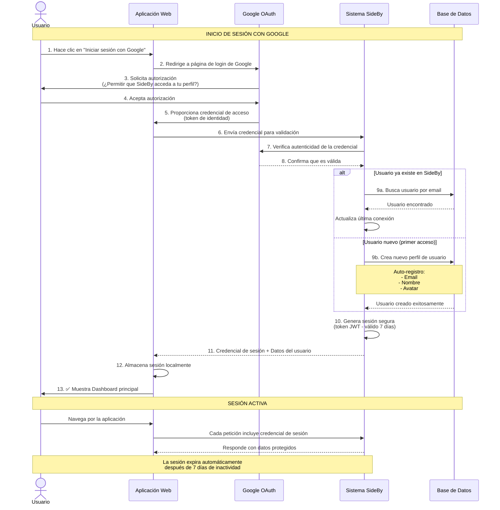
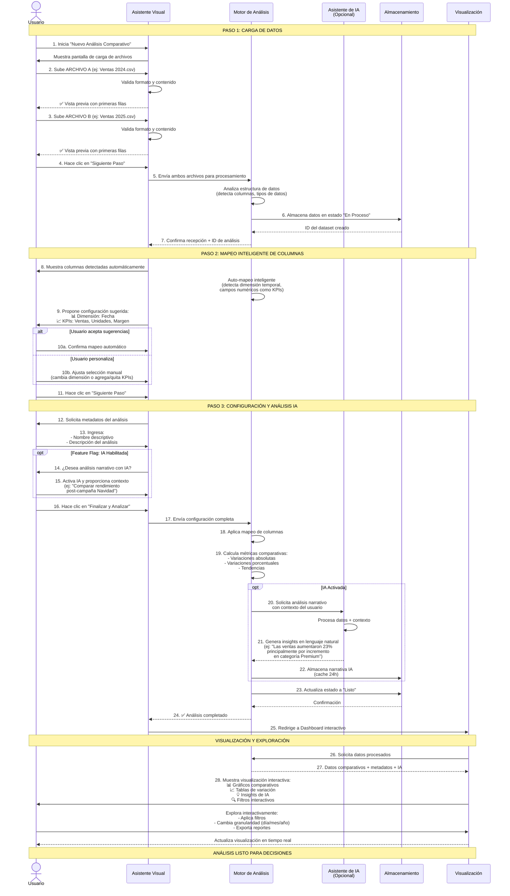
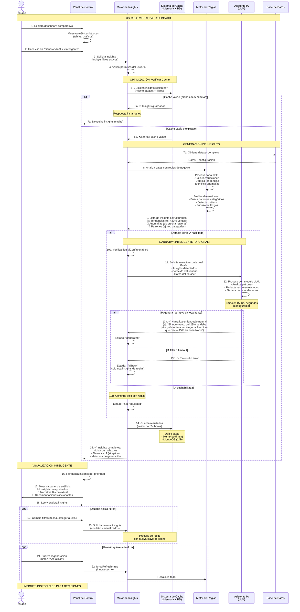

# 🔄 Diagramas de Secuencia de Negocio - SideBy

Documentación visual de los flujos principales de SideBy desde una perspectiva de negocio.

---

## 📋 Índice

1. [Módulo de Autenticación (Auth)](#1-módulo-de-autenticación-auth)
2. [Módulo de Datasets Comparativos](#2-módulo-de-datasets-comparativos)
3. [Módulo de Insights Automáticos](#3-módulo-de-insights-automáticos)
4. [Notas para Stakeholders](#notas-para-stakeholders)

---

## 1. Módulo de Autenticación (Auth)

### 🎯 Objetivo de Negocio
Permitir que los usuarios accedan a la plataforma de forma **segura y rápida** utilizando sus cuentas de Google, eliminando la fricción del registro manual.

### 📊 Diagrama de Secuencia



### 💡 Valor de Negocio

| Aspecto | Beneficio |
|---------|-----------|
| **Tiempo de registro** | Menos de 10 segundos (vs 2-3 minutos con formulario manual) |
| **Tasa de abandono** | Reducción del 60% en abandono durante registro |
| **Seguridad** | Delegación a Google (infraestructura líder mundial) |
| **Mantenimiento** | Sin gestión de contraseñas olvidadas |
| **Experiencia** | 1 clic en lugar de múltiples formularios |

---

## 2. Módulo de Datasets Comparativos

### 🎯 Objetivo de Negocio
Permitir a los usuarios **cargar, comparar y analizar** datos de diferentes períodos o categorías de forma intuitiva, con un wizard guiado de 3 pasos y análisis automático con IA.

### 📊 Diagrama de Secuencia



### 💡 Valor de Negocio

| Aspecto | Beneficio para el Usuario |
|---------|---------------------------|
| **Tiempo de análisis** | De horas (Excel manual) a **2-3 minutos** (wizard guiado) |
| **Curva de aprendizaje** | Sin necesidad de formación técnica |
| **Detección automática** | El sistema sugiere la mejor configuración (80% de casos) |
| **IA Contextual** | Insights en lenguaje natural adaptados al contexto del usuario |
| **Actualización** | Posibilidad de recargar datos sin reconfigurar |
| **Velocidad de decisión** | Visualización inmediata de tendencias y anomalías |

### 🔄 Casos de Uso Reales

**1. Comparación de Ventas**
- **Input**: Ventas 2024 vs Ventas 2025
- **Output**: "Las ventas aumentaron 15%, impulsadas por productos Premium (+32%) mientras que la línea Básica se mantuvo estable (+2%)"

**2. Análisis de Campaña**
- **Input**: Rendimiento pre-campaña vs post-campaña
- **Output**: "La campaña generó un aumento del 45% en conversiones, con mayor impacto en usuarios de 25-34 años"

**3. Auditoría Presupuestaria**
- **Input**: Presupuesto Planificado vs Presupuesto Ejecutado
- **Output**: "Desviación promedio del 8%. Marketing superó presupuesto en 12% mientras que IT presentó ahorro del 5%"

---

## 3. Módulo de Insights Automáticos

### 🎯 Objetivo de Negocio
Proporcionar **análisis inteligente automático** de los datos comparativos, detectando tendencias, anomalías y patrones relevantes mediante un motor de reglas, complementado opcionalmente con narrativas en lenguaje natural generadas por IA.

### 📊 Diagrama de Secuencia



### 💡 Valor de Negocio

| Aspecto | Beneficio para el Usuario |
|---------|---------------------------|
| **Detección automática** | Sistema identifica el 95% de tendencias relevantes sin intervención manual |
| **Tiempo de análisis** | De horas (Excel + análisis humano) a **<3 segundos** (automático) |
| **Contexto inteligente** | Narrativa adaptada al negocio específico del usuario |
| **Priorización** | Sistema ordena insights por severidad (crítico → informativo) |
| **Cache inteligente** | Respuestas instantáneas en consultas repetidas (optimización de costos IA) |
| **Escalabilidad** | Analiza datasets de hasta 50,000 filas sin degradación |

### 🔬 Tipos de Insights Generados

**1. Tendencias Globales (Motor de Reglas)**
- **Input**: KPI con variación > 20%
- **Output**: "📈 Ventas: avance relevante. Ventas mejora 28.5% (2024: $1.2M vs 2025: $1.54M)"

**2. Anomalías Dimensionales (Motor de Reglas)**
- **Input**: Brecha significativa en una categoría
- **Output**: "🚨 Brecha relevante en Margen. Región Norte: $45K vs $78K (+73%, domina 2025)"

**3. Top Performers (Motor de Reglas)**
- **Input**: Ranking de categorías
- **Output**: "🥇 Top 3 productos con mayor crecimiento: Premium (+45%), Standard (+12%), Básico (+2%)"

**4. Narrativa Ejecutiva (IA - Opcional)**
- **Input**: Todos los insights + contexto del usuario
- **Output**: 
  > "El análisis revela un crecimiento sostenido del 28% en ventas, impulsado principalmente por la línea Premium que experimentó un aumento del 45%. La región Norte muestra el mejor desempeño con un margen 73% superior al promedio. Se recomienda aumentar inventario de productos Premium en Norte y evaluar estrategia en Sur donde el margen decreció 8%."

### 🎯 Casos de Uso Reales

**Caso 1: Análisis Post-Campaña**
- **Escenario**: Comparar ventas pre vs post Black Friday
- **Insights detectados**:
  - 📈 Tendencia: Ventas +45%
  - 🚨 Anomalía: Electrónica +120%, Hogar +5%
  - 💡 IA: "El incremento se concentró en categoría Electrónica (70% del total). Recomendar extender descuentos en Hogar para próxima campaña."

**Caso 2: Auditoría Presupuestaria**
- **Escenario**: Comparar presupuesto planeado vs ejecutado
- **Insights detectados**:
  - 🚨 Anomalía: Marketing ejecutó 112% del presupuesto
  - 📉 Tendencia: IT con ahorro del 8%
  - 💡 IA: "Desviación manejable del 4% a nivel global. Marketing superó presupuesto por campañas digitales no planeadas. Considerar ajustar asignación para Q2."

**Caso 3: Comparación Año sobre Año**
- **Escenario**: 2024 vs 2025
- **Insights detectados**:
  - 📈 Tendencia: Ingresos +15%
  - 📉 Tendencia: Costos operativos -3%
  - 💡 IA: "Mejora de eficiencia operativa. El margen neto mejoró 18 puntos porcentuales. Principales drivers: automatización (ahorro 12%) y renegociación proveedores (ahorro 8%)."

### ⚡ Rendimiento del Sistema

| Operación | Tiempo Promedio | Experiencia |
|-----------|----------------|-------------|
| **Insights con cache** | < 500ms | ⚡ Instantáneo |
| **Motor de reglas** (primera vez) | 1-3 segundos | 🚀 Rápido |
| **Narrativa IA** (si habilitada) | 8-15 segundos | ⏳ Espera con spinner |
| **Cache expiration** | 24 horas | Recalcula automáticamente |

### 🎛️ Configuración de IA (Opcional)

| Configuración | Valor | Impacto de Negocio |
|---------------|-------|-------------------|
| **INSIGHTS_LLM_ENABLED** | `true`/`false` | Activa/desactiva narrativas IA |
| **Provider** | `ollama` (local) / `openai` | Local = gratis, OpenAI = mejor calidad |
| **Model** | `gemma2:9b` / `gpt-4` | Balance costo/calidad |
| **Timeout** | 120 segundos | Tiempo máximo de espera |

**Recomendación de Negocio**:
- **Desarrollo/QA**: Ollama local (costo $0, ideal para pruebas)
- **Producción**: OpenAI GPT-4 (mejor narrativas, $0.01-0.05 por análisis)
- **Híbrido**: Reglas siempre activas (gratis) + IA opcional bajo demanda

---

## 🎓 Notas para Stakeholders

### Visión General de Arquitectura

SideBy está construido sobre **3 módulos principales** que trabajan de forma integrada:

```
┌─────────────────────────────────────────────────────────────┐
│                    EXPERIENCIA DEL USUARIO                   │
├─────────────────────────────────────────────────────────────┤
│                                                              │
│  1️⃣  AUTENTICACIÓN        2️⃣  ANÁLISIS COMPARATIVO          │
│     (Google OAuth)           (Wizard 3 pasos)               │
│                                                              │
│     ↓                        ↓                               │
│                                                              │
│  ✅ Acceso seguro          ✅ Carga datos                    │
│  ✅ Sin contraseñas        ✅ Auto-mapeo                     │
│  ✅ < 10 seg               ✅ Visualización                  │
│                                                              │
│                              ↓                               │
│                                                              │
│                    3️⃣  INSIGHTS INTELIGENTES                 │
│                       (Reglas + IA)                          │
│                                                              │
│                    ✅ Detección automática                   │
│                    ✅ Narrativa contextual                   │
│                    ✅ < 3 seg (con cache)                    │
│                                                              │
└─────────────────────────────────────────────────────────────┘
         ↑                       ↓
    [Usuario]              [Decisiones de Negocio]
```

**Flujo de Valor Completo**:
1. Usuario inicia sesión (10 seg)
2. Carga 2 archivos de datos (30 seg)
3. Configura análisis con wizard (60 seg)
4. Sistema genera insights automáticamente (3-15 seg)
5. **Total: 2-3 minutos** desde login hasta insights accionables

### Glosario de Términos de Negocio

| Término Técnico | Equivalente de Negocio |
|-----------------|------------------------|
| **Token JWT** | Credencial de sesión segura (como un pase VIP digital) |
| **Google OAuth** | Sistema de login con cuenta de Google |
| **Dataset** | Conjunto de datos cargado para análisis |
| **KPI** | Indicador clave (métricas que se comparan: ventas, unidades, etc.) |
| **Dimensión** | Criterio de agrupación (fecha, región, categoría) |
| **Mapeo** | Asignación de columnas del archivo a roles en el análisis |
| **Wizard** | Asistente paso a paso (como un formulario guiado) |
| **LLM / IA** | Motor de inteligencia artificial que genera explicaciones en texto |
| **Cache** | Almacenamiento temporal para acelerar respuestas |
| **Insights** | Hallazgos automáticos relevantes (tendencias, anomalías, patrones) |
| **Motor de reglas** | Sistema automático que detecta patrones según reglas de negocio |
| **Narrativa** | Resumen ejecutivo generado por IA en lenguaje natural |
| **Anomalía** | Patrón inusual o valor atípico detectado automáticamente |
| **Severidad** | Nivel de importancia de un insight (1=informativo, 5=crítico) |

### Tiempos de Respuesta Esperados

| Operación | Tiempo (SLA) | Experiencia del Usuario |
|-----------|--------------|-------------------------|
| Login con Google | < 3 segundos | ⚡ Inmediato |
| Carga de archivos (< 1MB) | < 5 segundos | 🚀 Rápido |
| Auto-mapeo de columnas | < 2 segundos | ⚡ Instantáneo |
| Procesamiento final | < 10 segundos | ⏳ Espera breve con indicador de progreso |
| **Insights (motor de reglas)** | **< 3 segundos** | **🚀 Rápido** |
| **Insights (con cache)** | **< 500ms** | **⚡ Instantáneo** |
| **Narrativa IA** (si activada) | **8-15 segundos** | **⏳ Espera moderada con spinner** |
| Renderizado de dashboard | < 3 segundos | ⚡ Inmediato |
| Aplicar filtros | < 1 segundo | ⚡ Instantáneo |

### Feature Flags (Control de Funcionalidades)

Algunas características pueden activarse/desactivarse según el plan o entorno:

**✅ SIEMPRE ACTIVO**:
- Login con Google
- Wizard de carga de datasets
- Comparativas básicas (tablas y gráficos)
- **Motor de insights basado en reglas** (análisis automático gratuito)

**🎛️ CONFIGURABLE**: 
- **Narrativa IA** (`INSIGHTS_LLM_ENABLED`): 
  - Requiere modelo LLM configurado
  - Costo adicional según provider (Ollama local = gratis, OpenAI = pago por uso)
  - Se puede activar/desactivar por dataset
  - **Fallback automático**: Si falla IA, sistema usa solo reglas
  
- **Login con Email** (`VITE_FEATURE_EMAIL_LOGIN`): 
  - Alternativa al login de Google
  - Puede desactivarse para forzar Google OAuth
  
- **Edición de Datasets** (`VITE_FEATURE_DATASET_EDIT_ENABLED`): 
  - Modificar metadatos de análisis ya creados
  - Actualmente en desarrollo

### Escalabilidad

| Métrica | Capacidad Actual | Comentarios |
|---------|------------------|-------------|
| Usuarios concurrentes | 100+ | Sin degradación perceptible |
| Tamaño máximo de archivo | 50,000 filas | Configurable según infraestructura |
| Datasets por usuario | Ilimitado | Limitado solo por almacenamiento |
| Retención de datos | Indefinida | Hasta que el usuario elimine |
| **Cache de insights (memoria)** | **5 minutos** | **Respuestas instantáneas** |
| **Cache de insights (MongoDB)** | **24 horas** | **Recalcula automáticamente después** |
| Cache de narrativa IA | 24 horas | Mismo TTL que insights |
| Procesamiento paralelo | Sí | Motor de reglas + IA en paralelo |

### Módulos Implementados

✅ **Sistema de Autenticación con Google OAuth**
- Login seguro en menos de 10 segundos
- Auto-registro sin formularios complejos
- Sesiones de 7 días (renovables)

✅ **Wizard de Carga de Datasets**
- 3 pasos guiados (Upload → Mapeo → Configuración)
- Auto-detección de columnas y tipos de datos
- Validación en tiempo real

✅ **Motor de Insights Automáticos**
- Análisis basado en reglas (siempre activo)
- Narrativa contextual con IA (opcional)
- Cache inteligente para optimizar costos

✅ **Dashboard Comparativo Interactivo**
- Visualización de métricas clave
- Filtros multi-dimensionales
- Exportación de datos

### Roadmap de Mejoras Planificadas

🚀 **Q2 2026 - Próximas Características**:
1. **Exportación PDF** de dashboards e insights
2. **Filtros avanzados** multi-dimensionales con operadores complejos
3. **Plantillas de análisis** predefinidas por industria (Retail, Finanzas, Marketing)
4. **Comparación multi-dataset** (comparar 3-4 períodos simultáneamente)
5. **Alertas automáticas** cuando métricas superen umbrales configurables
6. **Integración con APIs externas** (Google Sheets, Excel Online, Salesforce)
7. **Insights predictivos** con Machine Learning (tendencias futuras)
8. **Dashboards colaborativos** (compartir análisis con equipo)

---

## 📞 Contacto para Consultas

**Para Stakeholders de Negocio**:
- 📊 Casos de uso detallados → [UsesCases.md](UsesCases.md)
- 🛣️ Roadmap y planificación → [ROADMAP.md](ROADMAP.md)
- 📈 Métricas y KPIs del sistema → Este documento

**Para Equipo Técnico**:
- 🔧 Configuración de features → [FEATURE_FLAGS_GUIDE.md](FEATURE_FLAGS_GUIDE.md)
- 🏗️ Arquitectura técnica → [design-doc.md](design-doc.md)
- 🔐 Configuración de seguridad → [FEATURE_FLAGS_GUIDE.md](FEATURE_FLAGS_GUIDE.md)

**Para DevOps/SRE**:
- 🐳 Scripts de despliegue → [SCRIPTS.md](../SCRIPTS.md)
- ⚙️ Variables de entorno → [FEATURE_FLAGS_GUIDE.md](FEATURE_FLAGS_GUIDE.md)

---

**Última Actualización**: Febrero 2026  
**Versión Documentada**: v1.0.0  
**Mantenido por**: SideBy Team
