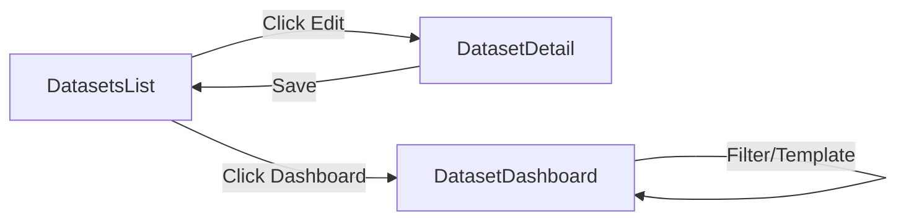

# [RFC-004] Dataset Management UI - List, Detail, Edit & Dashboard Template System

| Metadatos | Detalles |
| :--- | :--- |
| **Fecha / Date** | 2026-02-13 |
| **Estado / Status** | **Aprobado para Implementación / Approved for Implementation** |
| **Prioridad / Priority** | Alta |
| **Esfuerzo / Effort** | 4-5 días (post React Query migration) |
| **Alcance / Scope** | `apps/client/src/features/dataset` |
| **Dependencias** | RFC-React-Query-Migration (DEBE completarse primero) |
| **Autor / Author** | Engineering Team |

---

## 1. Contexto y Motivación / Context & Motivation

### Problema Actual / Current Problem

Actualmente, el flujo de datasets termina en el paso 3 (configuración de mapping). **No existe una UI completa para:**

❌ Ver datasets creados con datos REALES del backend  
❌ Editar metadatos de un dataset existente  
❌ Visualizar datos comparativos en un dashboard  
❌ Filtrar por dimensiones categóricas  
❌ Cambiar entre diferentes vistas/templates  

### Alcance del RFC-004 / Scope

Este RFC implementa el **ciclo completo de gestión de datasets:**



**Componentes a implementar:**

1. **DatasetsList** (actualización): Conectar con API real + botones Edit/Dashboard
2. **DatasetDetail** (nuevo): Página de edición de metadatos con feature flag
3. **DatasetDashboard** (nuevo): Visualización comparativa con sistema de templates

---

## 2. Arquitectura de la Solución / Solution Architecture

### 2.1 Routing Structure

```typescript
// solution-sideby/apps/client/src/routes/datasets.routes.tsx

export const datasetsRoutes = [
  {
    path: '/datasets',
    element: <DatasetsList />,
  },
  {
    path: '/datasets/new',
    element: <DataUploadWizard />,
  },
  {
    path: '/datasets/:id',
    element: <DatasetDetail />,        // 🆕 NUEVO - Edición
  },
  {
    path: '/datasets/:id/dashboard',
    element: <DatasetDashboard />,     // ✏️ ACTUALIZAR - Templates
  },
];
```

### 2.2 Feature Flag System

**Archivo:** `solution-sideby/apps/client/src/config/features.ts`

```typescript
export const FEATURES = Object.freeze({
  EMAIL_LOGIN: import.meta.env.VITE_FEATURE_EMAIL_LOGIN === "true" || false,
  AI_ENABLED: import.meta.env.VITE_FEATURE_AI_ENABLED === "true" || false,
  
  /**
   * 🆕 Habilita la edición de metadatos de datasets
   * Controla la visibilidad del botón "Edit" en DatasetsList
   * 
   * @default false
   * @env VITE_FEATURE_DATASET_EDIT_ENABLED
   */
  DATASET_EDIT_ENABLED: import.meta.env.VITE_FEATURE_DATASET_EDIT_ENABLED === "true" || false,
} as const);
```

**Configuración en `.env`:**

```bash
# .env.development
VITE_FEATURE_DATASET_EDIT_ENABLED=true

# .env.production
VITE_FEATURE_DATASET_EDIT_ENABLED=false  # Ocultar hasta completar 100%
```

### 2.3 Data Model (Backend Reference)

**Campos Editables del Dataset:**

```typescript
// Referencia: apps/api/src/modules/datasets/domain/Dataset.entity.ts

interface EditableDatasetFields {
  // Metadata general
  meta: {
    name: string;           // Editable
    description?: string;   // Editable
  };
  
  // Configuración de grupos
  sourceConfig: {
    groupA: {
      label: string;        // Editable ✅
      color: string;        // Editable ✅ (HEX picker)
    };
    groupB: {
      label: string;        // Editable ✅
      color: string;        // Editable ✅
    };
  };
  
  // Mapping de esquema
  schemaMapping: {
    kpiFields: Array<{
      id: string;           // Read-only
      columnName: string;   // Read-only
      label: string;        // Editable ✅
      format: KPIFormat;    // Editable ✅ (dropdown)
    }>;
  };
  
  // Configuración de IA
  aiConfig?: {
    enabled: boolean;       // Editable ✅ (toggle)
    userContext?: string;   // Editable ✅ (textarea)
  };
}
```

**Campos NO Editables (Read-Only):**
- `id`, `ownerId`, `status`
- `meta.createdAt`, `meta.updatedAt`
- `sourceConfig.groupA/B.originalFileName`, `rowCount`
- `schemaMapping.dimensionField`, `dateField`, `categoricalFields`
- `data` (array de filas)

---

## 3. Implementación TDD - PARTE 1: DatasetsList Update

### 3.1 Hook: `useDatasets` (ya migrado a React Query)

**Test Spec:**

```typescript
// features/dataset/hooks/__tests__/useDatasets.test.ts

describe('useDatasets with React Query', () => {
  it('debe cargar datasets del backend', async () => {
    const mockDatasets = [
      {
        id: '698f3809e7a4974e30e129c6',
        meta: { name: 'Q1 2024 vs 2023', description: 'Sales data' },
        status: 'ready',
        sourceConfig: {
          groupA: { label: '2024', color: '#3b82f6' },
          groupB: { label: '2023', color: '#ef4444' },
        },
      },
    ];
    
    vi.spyOn(api, 'listDatasets').mockResolvedValue(mockDatasets);
    
    const { result } = renderHook(() => useDatasets(), {
      wrapper: createQueryClientWrapper(),
    });
    
    await waitFor(() => {
      expect(result.current.isSuccess).toBe(true);
    });
    
    expect(result.current.data).toEqual(mockDatasets);
  });
});
```

**Implementación (ya cubierta en RFC-React-Query):**

```typescript
// features/dataset/hooks/useDatasets.ts
export function useDatasets() {
  return useQuery({
    queryKey: ['datasets'],
    queryFn: listDatasets,
    staleTime: 2 * 60 * 1000,
  });
}
```

### 3.2 API Service: `listDatasets`

**Archivo:** `solution-sideby/apps/client/src/features/dataset/services/datasets.api.ts`

```typescript
/**
 * Dataset API Client
 * 
 * Cliente HTTP para interactuar con el backend de datasets.
 * Usa axios configurado con interceptors de autenticación.
 */

import { apiClient } from '@/infrastructure/api/client';
import type { Dataset } from '../types/api.types';

/**
 * Obtiene la lista de datasets del usuario autenticado.
 * 
 * @returns Lista de datasets
 * @throws {Error} Si falla la autenticación o el request
 * 
 * @example
 * ```typescript
 * const datasets = await listDatasets();
 * console.log(`User has ${datasets.length} datasets`);
 * ```
 */
export async function listDatasets(): Promise<Dataset[]> {
  const response = await apiClient.get<Dataset[]>('/api/datasets');
  return response.data;
}

/**
 * Obtiene un dataset individual por ID.
 * 
 * @param datasetId - ID del dataset
 * @returns Dataset completo con datos
 */
export async function getDataset(datasetId: string): Promise<Dataset> {
  const response = await apiClient.get<Dataset>(`/api/datasets/${datasetId}`);
  return response.data;
}

/**
 * Actualiza los metadatos de un dataset.
 * 
 * @param datasetId - ID del dataset
 * @param payload - Campos a actualizar (partial)
 * @returns Dataset actualizado
 */
export async function updateDataset(
  datasetId: string,
  payload: Partial<EditableDatasetFields>
): Promise<Dataset> {
  const response = await apiClient.patch<Dataset>(
    `/api/datasets/${datasetId}`,
    payload
  );
  return response.data;
}

/**
 * Elimina un dataset permanentemente.
 * 
 * @param datasetId - ID del dataset
 */
export async function deleteDataset(datasetId: string): Promise<void> {
  await apiClient.delete(`/api/datasets/${datasetId}`);
}
```

### 3.3 Component: `DatasetsList` (actualización)

**Test Spec:**

```typescript
// features/dataset/pages/__tests__/DatasetsList.test.tsx

import { render, screen, waitFor } from '@testing-library/react';
import userEvent from '@testing-library/user-event';
import { DatasetsList } from '../DatasetsList';
import { createQueryClientWrapper } from '@/test/utils/react-query';
import * as api from '../../services/datasets.api';

describe('DatasetsList - Updated', () => {
  it('debe renderizar datasets del backend', async () => {
    const mockDatasets = [
      { id: '1', meta: { name: 'Dataset A' }, status: 'ready' },
      { id: '2', meta: { name: 'Dataset B' }, status: 'processing' },
    ];
    
    vi.spyOn(api, 'listDatasets').mockResolvedValue(mockDatasets);
    
    render(<DatasetsList />, { wrapper: createQueryClientWrapper() });
    
    // Esperar a que cargue
    await waitFor(() => {
      expect(screen.getByText('Dataset A')).toBeInTheDocument();
    });
    
    expect(screen.getByText('Dataset B')).toBeInTheDocument();
  });

  it('debe mostrar botón Edit si feature flag está habilitado', async () => {
    vi.stubEnv('VITE_FEATURE_DATASET_EDIT_ENABLED', 'true');
    
    const mockDatasets = [{ id: '1', meta: { name: 'Test' }, status: 'ready' }];
    vi.spyOn(api, 'listDatasets').mockResolvedValue(mockDatasets);
    
    render(<DatasetsList />, { wrapper: createQueryClientWrapper() });
    
    await waitFor(() => {
      expect(screen.getByLabelText('Edit dataset')).toBeInTheDocument();
    });
  });

  it('NO debe mostrar botón Edit si feature flag está deshabilitado', async () => {
    vi.stubEnv('VITE_FEATURE_DATASET_EDIT_ENABLED', 'false');
    
    const mockDatasets = [{ id: '1', meta: { name: 'Test' }, status: 'ready' }];
    vi.spyOn(api, 'listDatasets').mockResolvedValue(mockDatasets);
    
    render(<DatasetsList />, { wrapper: createQueryClientWrapper() });
    
    await waitFor(() => {
      expect(screen.queryByLabelText('Edit dataset')).not.toBeInTheDocument();
    });
  });

  it('debe navegar a dashboard al hacer click en botón Dashboard', async () => {
    const mockNavigate = vi.fn();
    vi.mock('react-router-dom', () => ({
      ...vi.importActual('react-router-dom'),
      useNavigate: () => mockNavigate,
    }));
    
    const mockDatasets = [{ id: '123', meta: { name: 'Test' }, status: 'ready' }];
    vi.spyOn(api, 'listDatasets').mockResolvedValue(mockDatasets);
    
    render(<DatasetsList />, { wrapper: createQueryClientWrapper() });
    
    const dashboardBtn = await screen.findByLabelText('View dashboard');
    await userEvent.click(dashboardBtn);
    
    expect(mockNavigate).toHaveBeenCalledWith('/datasets/123/dashboard');
  });
});
```

**Implementación:**

```typescript
// features/dataset/pages/DatasetsList.tsx (ACTUALIZADO)

import { SidebarProvider } from "@/shared/components/ui/sidebar";
import { AppSidebar } from "@/shared/components/AppSidebar";
import { Button } from "@/shared/components/ui/button";
import { Plus, Pencil, BarChart3 } from "lucide-react";
import { useNavigate } from "react-router-dom";
import { useDatasets } from "../hooks/useDatasets";
import { FEATURES } from "@/config/features";
import { DatasetCard } from "../components/DatasetCard";
import { EmptyDatasets } from "../components/EmptyDatasets";
import type { Dataset } from "../types/api.types";

export const DatasetsList = () => {
  const navigate = useNavigate();
  
  // ✅ React Query hook (con cache automático)
  const { data: datasets = [], isLoading, error, refetch } = useDatasets();

  /**
   * Navega al dashboard de un dataset
   */
  const handleOpenDashboard = (datasetId: string) => {
    navigate(`/datasets/${datasetId}/dashboard`);
  };

  /**
   * Navega a la página de edición (solo si feature flag está activo)
   */
  const handleEditDataset = (datasetId: string) => {
    navigate(`/datasets/${datasetId}`);
  };

  /**
   * Navega al wizard de creación
   */
  const handleCreateNew = () => {
    navigate('/datasets/new');
  };

  return (
    <SidebarProvider defaultOpen={true}>
      <div className="flex min-h-screen w-full">
        <AppSidebar />

        <main className="flex-1 overflow-auto">
          <div className="container max-w-5xl py-6 space-y-6">
            
            {/* Header */}
            <div className="flex items-center justify-between">
              <div>
                <h1 className="text-2xl font-semibold">Mis Datasets</h1>
                <p className="text-sm text-muted-foreground">
                  Gestiona tus datasets comparativos
                </p>
              </div>
              <Button onClick={handleCreateNew} className="gap-2">
                <Plus className="h-4 w-4" />
                Crear Nuevo
              </Button>
            </div>

            {/* Error State */}
            {error && (
              <div className="rounded-lg border border-destructive/50 bg-destructive/10 p-4">
                <p className="text-sm font-medium text-destructive">
                  Error al cargar datasets
                </p>
                <p className="text-sm text-destructive/80 mt-1">
                  {error.message}
                </p>
                <Button 
                  variant="outline" 
                  size="sm" 
                  onClick={() => refetch()} 
                  className="mt-3"
                >
                  Reintentar
                </Button>
              </div>
            )}

            {/* Loading State */}
            {isLoading && (
              <div className="space-y-3">
                {[1, 2, 3].map((i) => (
                  <div
                    key={i}
                    className="h-32 rounded-lg border bg-muted/20 animate-pulse"
                  />
                ))}
              </div>
            )}

            {/* Datasets List */}
            {!isLoading && !error && (
              <>
                {datasets.length === 0 ? (
                  <EmptyDatasets onCreateNew={handleCreateNew} />
                ) : (
                  <div className="space-y-3">
                    {datasets.map((dataset) => (
                      <DatasetCard
                        key={dataset.id}
                        dataset={dataset}
                        onOpenDashboard={handleOpenDashboard}
                        onEdit={
                          FEATURES.DATASET_EDIT_ENABLED
                            ? handleEditDataset
                            : undefined
                        }
                      />
                    ))}
                  </div>
                )}
              </>
            )}
          </div>
        </main>
      </div>
    </SidebarProvider>
  );
};
```

### 3.4 Component: `DatasetCard` (actualización)

**Implementación:**

```typescript
// features/dataset/components/DatasetCard.tsx (ACTUALIZADO)

import { Card, CardHeader, CardTitle, CardDescription, CardContent } from "@/shared/components/ui/card";
import { Button } from "@/shared/components/ui/button";
import { Badge } from "@/shared/components/ui/badge";
import { BarChart3, Pencil, Trash2 } from "lucide-react";
import { format } from "date-fns";
import { es } from "date-fns/locale";
import type { Dataset } from "../types/api.types";

interface DatasetCardProps {
  dataset: Dataset;
  onOpenDashboard: (id: string) => void;
  onEdit?: (id: string) => void;  // Opcional (feature flag)
  onDelete?: (id: string) => void; // Opcional (futuro)
}

export const DatasetCard = ({
  dataset,
  onOpenDashboard,
  onEdit,
  onDelete,
}: DatasetCardProps) => {
  const { id, meta, status, sourceConfig } = dataset;

  /**
   * Badge de estado del dataset
   */
  const statusConfig = {
    processing: { label: 'Procesando', variant: 'secondary' as const },
    ready: { label: 'Listo', variant: 'success' as const },
    error: { label: 'Error', variant: 'destructive' as const },
  };

  return (
    <Card className="hover:shadow-md transition-shadow">
      <CardHeader>
        <div className="flex items-start justify-between">
          <div className="flex-1">
            <CardTitle className="text-lg">{meta.name}</CardTitle>
            {meta.description && (
              <CardDescription className="mt-1">
                {meta.description}
              </CardDescription>
            )}
          </div>
          <Badge variant={statusConfig[status].variant}>
            {statusConfig[status].label}
          </Badge>
        </div>
      </CardHeader>

      <CardContent>
        <div className="flex items-center justify-between">
          {/* Metadata */}
          <div className="flex items-center gap-4 text-sm text-muted-foreground">
            <div className="flex items-center gap-2">
              <div
                className="w-3 h-3 rounded-full"
                style={{ backgroundColor: sourceConfig.groupA.color }}
              />
              <span>{sourceConfig.groupA.label}</span>
            </div>
            <span>vs</span>
            <div className="flex items-center gap-2">
              <div
                className="w-3 h-3 rounded-full"
                style={{ backgroundColor: sourceConfig.groupB.color }}
              />
              <span>{sourceConfig.groupB.label}</span>
            </div>
            <span className="text-xs">
              • {format(new Date(meta.createdAt), "d MMM yyyy", { locale: es })}
            </span>
          </div>

          {/* Actions */}
          <div className="flex items-center gap-2">
            {/* Botón Dashboard (siempre visible) */}
            <Button
              variant="default"
              size="sm"
              onClick={() => onOpenDashboard(id)}
              className="gap-2"
              aria-label="View dashboard"
            >
              <BarChart3 className="h-4 w-4" />
              Dashboard
            </Button>

            {/* Botón Edit (solo si feature flag activo) */}
            {onEdit && (
              <Button
                variant="outline"
                size="sm"
                onClick={() => onEdit(id)}
                className="gap-2"
                aria-label="Edit dataset"
              >
                <Pencil className="h-4 w-4" />
                Editar
              </Button>
            )}

            {/* Botón Delete (futuro) */}
            {onDelete && (
              <Button
                variant="ghost"
                size="sm"
                onClick={() => onDelete(id)}
                className="text-destructive hover:text-destructive"
                aria-label="Delete dataset"
              >
                <Trash2 className="h-4 w-4" />
              </Button>
            )}
          </div>
        </div>
      </CardContent>
    </Card>
  );
};
```

---

## 4. Implementación TDD - PARTE 2: DatasetDetail (Edición)

### 4.1 Hook: `useUpdateDataset`

**Test Spec:**

```typescript
// features/dataset/hooks/__tests__/useUpdateDataset.test.ts

import { renderHook, waitFor, act } from '@testing-library/react';
import { useUpdateDataset } from '../useUpdateDataset';
import { createQueryClientWrapper } from '@/test/utils/react-query';
import * as api from '../../services/datasets.api';

describe('useUpdateDataset', () => {
  it('debe actualizar dataset y invalidar cache', async () => {
    const mockUpdatedDataset = {
      id: '123',
      meta: { name: 'Updated Name' },
    };
    
    vi.spyOn(api, 'updateDataset').mockResolvedValue(mockUpdatedDataset);
    
    const { result } = renderHook(() => useUpdateDataset(), {
      wrapper: createQueryClientWrapper(),
    });
    
    act(() => {
      result.current.mutate({
        id: '123',
        payload: { meta: { name: 'Updated Name' } },
      });
    });
    
    await waitFor(() => {
      expect(result.current.isSuccess).toBe(true);
    });
    
    expect(result.current.data).toEqual(mockUpdatedDataset);
  });

  it('debe implementar optimistic update', async () => {
    const queryClient = createTestQueryClient();
    
    // Pre-poblar cache con dataset original
    queryClient.setQueryData(['dataset', '123'], {
      id: '123',
      meta: { name: 'Original' },
    });
    
    const { result } = renderHook(() => useUpdateDataset(), {
      wrapper: createWrapper(queryClient),
    });
    
    act(() => {
      result.current.mutate({
        id: '123',
        payload: { meta: { name: 'Optimistic' } },
      });
    });
    
    // Cache debe actualizarse inmediatamente (antes de la respuesta)
    const cachedData = queryClient.getQueryData(['dataset', '123']);
    expect(cachedData.meta.name).toBe('Optimistic');
  });
});
```

**Implementación:**

```typescript
// features/dataset/hooks/useUpdateDataset.ts

import { useMutation, useQueryClient } from '@tanstack/react-query';
import { updateDataset } from '../services/datasets.api';
import type { Dataset } from '../types/api.types';

interface UpdateDatasetParams {
  id: string;
  payload: Partial<Dataset>;
}

/**
 * Hook para actualizar metadatos de un dataset.
 * 
 * Implementa optimistic updates para feedback inmediato en la UI.
 * Invalida automáticamente el cache de la lista y del detalle.
 * 
 * @returns Mutation object con mutate, isLoading, error
 * 
 * @example
 * ```tsx
 * const updateMutation = useUpdateDataset();
 * 
 * const handleSave = async (formData) => {
 *   await updateMutation.mutateAsync({
 *     id: datasetId,
 *     payload: {
 *       meta: { name: formData.name },
 *       sourceConfig: {
 *         groupA: { label: formData.labelA, color: formData.colorA },
 *       },
 *     },
 *   });
 *   
 *   toast.success('Dataset actualizado');
 *   navigate(`/datasets/${datasetId}/dashboard`);
 * };
 * ```
 */
export function useUpdateDataset() {
  const queryClient = useQueryClient();
  
  return useMutation({
    mutationFn: ({ id, payload }: UpdateDatasetParams) =>
      updateDataset(id, payload),
    
    // ⚡ Optimistic Update: Actualizar UI inmediatamente
    onMutate: async ({ id, payload }) => {
      // Cancelar queries en curso para evitar race condition
      await queryClient.cancelQueries({ queryKey: ['dataset', id] });
      
      // Snapshot del estado anterior (para rollback)
      const previousDataset = queryClient.getQueryData(['dataset', id]);
      
      // Actualizar cache optimísticamente
      queryClient.setQueryData(['dataset', id], (old: any) => ({
        ...old,
        ...payload,
        meta: { ...old.meta, ...payload.meta },
        sourceConfig: {
          groupA: { ...old.sourceConfig.groupA, ...payload.sourceConfig?.groupA },
          groupB: { ...old.sourceConfig.groupB, ...payload.sourceConfig?.groupB },
        },
      }));
      
      return { previousDataset };
    },
    
    // ❌ Rollback en caso de error
    onError: (err, { id }, context) => {
      queryClient.setQueryData(['dataset', id], context?.previousDataset);
    },
    
    // ✅ Revalidar después de éxito
    onSuccess: (_, { id }) => {
      queryClient.invalidateQueries({ queryKey: ['dataset', id] });
      queryClient.invalidateQueries({ queryKey: ['datasets'] });
    },
  });
}
```

### 4.2 Page: `DatasetDetail`

**Test Spec:**

```typescript
// features/dataset/pages/__tests__/DatasetDetail.test.tsx

import { render, screen, waitFor } from '@testing-library/react';
import userEvent from '@testing-library/user-event';
import { DatasetDetail } from '../DatasetDetail';
import { createQueryClientWrapper } from '@/test/utils/react-query';
import * as api from '../../services/datasets.api';

describe('DatasetDetail - Edit Page', () => {
  it('debe cargar y mostrar datos del dataset', async () => {
    const mockDataset = {
      id: '123',
      meta: { name: 'Test Dataset', description: 'Description' },
      sourceConfig: {
        groupA: { label: '2024', color: '#3b82f6' },
        groupB: { label: '2023', color: '#ef4444' },
      },
      schemaMapping: {
        kpiFields: [
          { id: 'kpi1', columnName: 'revenue', label: 'Revenue', format: 'currency' },
        ],
      },
    };
    
    vi.spyOn(api, 'getDataset').mockResolvedValue(mockDataset);
    
    render(<DatasetDetail />, { 
      wrapper: createQueryClientWrapper(),
      initialRoute: '/datasets/123',
    });
    
    await waitFor(() => {
      expect(screen.getByDisplayValue('Test Dataset')).toBeInTheDocument();
    });
    
    expect(screen.getByDisplayValue('2024')).toBeInTheDocument();
    expect(screen.getByDisplayValue('Revenue')).toBeInTheDocument();
  });

  it('debe actualizar dataset al hacer submit', async () => {
    const mockDataset = {
      id: '123',
      meta: { name: 'Original' },
      sourceConfig: {
        groupA: { label: 'Group A', color: '#3b82f6' },
        groupB: { label: 'Group B', color: '#ef4444' },
      },
    };
    
    vi.spyOn(api, 'getDataset').mockResolvedValue(mockDataset);
    vi.spyOn(api, 'updateDataset').mockResolvedValue({
      ...mockDataset,
      meta: { name: 'Updated' },
    });
    
    render(<DatasetDetail />, { 
      wrapper: createQueryClientWrapper(),
      initialRoute: '/datasets/123',
    });
    
    // Esperar a que cargue
    const nameInput = await screen.findByLabelText('Nombre del dataset');
    
    // Editar
    await userEvent.clear(nameInput);
    await userEvent.type(nameInput, 'Updated');
    
    // Guardar
    const saveBtn = screen.getByRole('button', { name: /guardar/i });
    await userEvent.click(saveBtn);
    
    await waitFor(() => {
      expect(api.updateDataset).toHaveBeenCalledWith('123', {
        meta: { name: 'Updated' },
      });
    });
  });
});
```

**Implementación:**

```typescript
// features/dataset/pages/DatasetDetail.tsx (NUEVO)

import { useState } from 'react';
import { useParams, useNavigate } from 'react-router-dom';
import { useForm } from 'react-hook-form';
import { zodResolver } from '@hookform/resolvers/zod';
import { z } from 'zod';
import { SidebarProvider } from '@/shared/components/ui/sidebar';
import { AppSidebar } from '@/shared/components/AppSidebar';
import { Button } from '@/shared/components/ui/button';
import { Input } from '@/shared/components/ui/input';
import { Textarea } from '@/shared/components/ui/textarea';
import { Label } from '@/shared/components/ui/label';
import { Card, CardHeader, CardTitle, CardContent } from '@/shared/components/ui/card';
import { Select, SelectContent, SelectItem, SelectTrigger, SelectValue } from '@/shared/components/ui/select';
import { Switch } from '@/shared/components/ui/switch';
import { ArrowLeft, Save } from 'lucide-react';
import { useDataset } from '../hooks/useDataset';
import { useUpdateDataset } from '../hooks/useUpdateDataset';
import { Spinner } from '@/shared/components/Spinner';

/**
 * Schema de validación para el formulario de edición
 */
const datasetEditSchema = z.object({
  name: z.string().min(3, 'Mínimo 3 caracteres').max(100),
  description: z.string().max(500).optional(),
  groupALabel: z.string().min(1, 'Requerido'),
  groupAColor: z.string().regex(/^#[0-9A-Fa-f]{6}$/, 'Color hex inválido'),
  groupBLabel: z.string().min(1, 'Requerido'),
  groupBColor: z.string().regex(/^#[0-9A-Fa-f]{6}$/, 'Color hex inválido'),
  aiEnabled: z.boolean(),
  aiContext: z.string().max(1000).optional(),
  kpiFields: z.array(z.object({
    id: z.string(),
    label: z.string().min(1),
    format: z.enum(['number', 'currency', 'percentage']),
  })),
});

type DatasetEditForm = z.infer<typeof datasetEditSchema>;

export const DatasetDetail = () => {
  const { id } = useParams<{ id: string }>();
  const navigate = useNavigate();
  
  // ✅ React Query hooks
  const { data: dataset, isLoading, error } = useDataset(id || null);
  const updateMutation = useUpdateDataset();
  
  // ✅ React Hook Form con Zod validation
  const {
    register,
    handleSubmit,
    formState: { errors, isDirty },
    setValue,
    watch,
  } = useForm<DatasetEditForm>({
    resolver: zodResolver(datasetEditSchema),
    values: dataset ? {
      name: dataset.meta.name,
      description: dataset.meta.description || '',
      groupALabel: dataset.sourceConfig.groupA.label,
      groupAColor: dataset.sourceConfig.groupA.color,
      groupBLabel: dataset.sourceConfig.groupB.label,
      groupBColor: dataset.sourceConfig.groupB.color,
      aiEnabled: dataset.aiConfig?.enabled || false,
      aiContext: dataset.aiConfig?.userContext || '',
      kpiFields: dataset.schemaMapping?.kpiFields || [],
    } : undefined,
  });
  
  /**
   * Handler del submit del formulario
   */
  const onSubmit = async (formData: DatasetEditForm) => {
    if (!id) return;
    
    try {
      await updateMutation.mutateAsync({
        id,
        payload: {
          meta: {
            name: formData.name,
            description: formData.description,
          },
          sourceConfig: {
            groupA: {
              ...dataset!.sourceConfig.groupA,
              label: formData.groupALabel,
              color: formData.groupAColor,
            },
            groupB: {
              ...dataset!.sourceConfig.groupB,
              label: formData.groupBLabel,
              color: formData.groupBColor,
            },
          },
          schemaMapping: {
            ...dataset!.schemaMapping,
            kpiFields: formData.kpiFields,
          },
          aiConfig: {
            enabled: formData.aiEnabled,
            userContext: formData.aiContext,
          },
        },
      });
      
      // Navegar al dashboard después de guardar
      navigate(`/datasets/${id}/dashboard`);
    } catch (err) {
      console.error('Error al actualizar dataset:', err);
    }
  };
  
  // Loading state
  if (isLoading) {
    return (
      <div className="flex items-center justify-center min-h-screen">
        <Spinner size="lg" />
      </div>
    );
  }
  
  // Error state
  if (error || !dataset) {
    return (
      <div className="flex items-center justify-center min-h-screen">
        <Card className="w-full max-w-md">
          <CardHeader>
            <CardTitle className="text-destructive">Error al cargar dataset</CardTitle>
          </CardHeader>
          <CardContent>
            <p className="text-sm text-muted-foreground mb-4">
              {error?.message || 'Dataset no encontrado'}
            </p>
            <Button onClick={() => navigate('/datasets')}>
              Volver a la lista
            </Button>
          </CardContent>
        </Card>
      </div>
    );
  }
  
  return (
    <SidebarProvider defaultOpen={true}>
      <div className="flex min-h-screen w-full">
        <AppSidebar />
        
        <main className="flex-1 overflow-auto">
          <div className="container max-w-4xl py-6 space-y-6">
            
            {/* Header */}
            <div className="flex items-center justify-between">
              <div className="flex items-center gap-4">
                <Button
                  variant="ghost"
                  size="sm"
                  onClick={() => navigate('/datasets')}
                >
                  <ArrowLeft className="h-4 w-4 mr-2" />
                  Volver
                </Button>
                <div>
                  <h1 className="text-2xl font-semibold">Editar Dataset</h1>
                  <p className="text-sm text-muted-foreground">
                    Modifica los metadatos y configuración
                  </p>
                </div>
              </div>
              
              <Button
                onClick={handleSubmit(onSubmit)}
                disabled={!isDirty || updateMutation.isPending}
                className="gap-2"
              >
                <Save className="h-4 w-4" />
                {updateMutation.isPending ? 'Guardando...' : 'Guardar Cambios'}
              </Button>
            </div>
            
            <form onSubmit={handleSubmit(onSubmit)} className="space-y-6">
              {/* Sección 1: Información General */}
              <Card>
                <CardHeader>
                  <CardTitle>Información General</CardTitle>
                </CardHeader>
                <CardContent className="space-y-4">
                  <div>
                    <Label htmlFor="name">Nombre del dataset *</Label>
                    <Input
                      id="name"
                      {...register('name')}
                      placeholder="Ej: Ventas Q1 2024 vs 2023"
                    />
                    {errors.name && (
                      <p className="text-sm text-destructive mt-1">
                        {errors.name.message}
                      </p>
                    )}
                  </div>
                  
                  <div>
                    <Label htmlFor="description">Descripción</Label>
                    <Textarea
                      id="description"
                      {...register('description')}
                      rows={3}
                      placeholder="Describe qué contiene este dataset..."
                    />
                  </div>
                </CardContent>
              </Card>
              
              {/* Sección 2: Configuración de Grupos */}
              <Card>
                <CardHeader>
                  <CardTitle>Grupos Comparativos</CardTitle>
                </CardHeader>
                <CardContent className="space-y-6">
                  {/* Grupo A */}
                  <div className="grid grid-cols-2 gap-4">
                    <div>
                      <Label htmlFor="groupALabel">Etiqueta Grupo A *</Label>
                      <Input
                        id="groupALabel"
                        {...register('groupALabel')}
                        placeholder="Ej: 2024"
                      />
                    </div>
                    <div>
                      <Label htmlFor="groupAColor">Color Grupo A *</Label>
                      <div className="flex gap-2">
                        <Input
                          id="groupAColor"
                          type="color"
                          {...register('groupAColor')}
                          className="w-20 h-10"
                        />
                        <Input
                          value={watch('groupAColor')}
                          onChange={(e) => setValue('groupAColor', e.target.value)}
                          placeholder="#3b82f6"
                        />
                      </div>
                    </div>
                  </div>
                  
                  {/* Grupo B */}
                  <div className="grid grid-cols-2 gap-4">
                    <div>
                      <Label htmlFor="groupBLabel">Etiqueta Grupo B *</Label>
                      <Input
                        id="groupBLabel"
                        {...register('groupBLabel')}
                        placeholder="Ej: 2023"
                      />
                    </div>
                    <div>
                      <Label htmlFor="groupBColor">Color Grupo B *</Label>
                      <div className="flex gap-2">
                        <Input
                          id="groupBColor"
                          type="color"
                          {...register('groupBColor')}
                          className="w-20 h-10"
                        />
                        <Input
                          value={watch('groupBColor')}
                          onChange={(e) => setValue('groupBColor', e.target.value)}
                          placeholder="#ef4444"
                        />
                      </div>
                    </div>
                  </div>
                </CardContent>
              </Card>
              
              {/* Sección 3: KPIs */}
              <Card>
                <CardHeader>
                  <CardTitle>Campos KPI</CardTitle>
                </CardHeader>
                <CardContent>
                  <div className="space-y-3">
                    {watch('kpiFields').map((kpi, index) => (
                      <div key={kpi.id} className="grid grid-cols-2 gap-4 p-3 border rounded-lg">
                        <div>
                          <Label>Etiqueta</Label>
                          <Input
                            {...register(`kpiFields.${index}.label`)}
                            placeholder="Revenue"
                          />
                        </div>
                        <div>
                          <Label>Formato</Label>
                          <Select
                            value={watch(`kpiFields.${index}.format`)}
                            onValueChange={(value) =>
                              setValue(`kpiFields.${index}.format`, value as any)
                            }
                          >
                            <SelectTrigger>
                              <SelectValue />
                            </SelectTrigger>
                            <SelectContent>
                              <SelectItem value="number">Número</SelectItem>
                              <SelectItem value="currency">Moneda</SelectItem>
                              <SelectItem value="percentage">Porcentaje</SelectItem>
                            </SelectContent>
                          </Select>
                        </div>
                      </div>
                    ))}
                  </div>
                </CardContent>
              </Card>
              
              {/* Sección 4: Configuración de IA */}
              <Card>
                <CardHeader>
                  <CardTitle>Análisis con IA</CardTitle>
                </CardHeader>
                <CardContent className="space-y-4">
                  <div className="flex items-center justify-between">
                    <Label htmlFor="aiEnabled">Habilitar análisis con IA</Label>
                    <Switch
                      id="aiEnabled"
                      checked={watch('aiEnabled')}
                      onCheckedChange={(checked) => setValue('aiEnabled', checked)}
                    />
                  </div>
                  
                  {watch('aiEnabled') && (
                    <div>
                      <Label htmlFor="aiContext">Contexto para IA</Label>
                      <Textarea
                        id="aiContext"
                        {...register('aiContext')}
                        rows={3}
                        placeholder="Proporciona contexto adicional para los análisis de IA..."
                      />
                    </div>
                  )}
                </CardContent>
              </Card>
            </form>
          </div>
        </main>
      </div>
    </SidebarProvider>
  );
};
```

---

## 5. Implementación TDD - PARTE 3: DatasetDashboard (Templates)

### 5.1 Dashboard Template System Architecture

**Concepto:** Sistema de plantillas predefinidas que determinan qué componentes se renderizan y cómo.

```typescript
// features/dataset/types/templates.types.ts

/**
 * Identificadores de templates disponibles
 */
export type DashboardTemplateId = 'sideby_executive' | 'sideby_trends' | 'sideby_detailed';

/**
 * Configuración de un template
 */
export interface DashboardTemplateConfig {
  id: DashboardTemplateId;
  name: string;
  description: string;
  icon: React.ComponentType;
  maxKPICards: number;
  components: TemplateComponent[];
}

/**
 * Componente dentro de un template
 */
export interface TemplateComponent {
  type: 'kpi-grid' | 'chart' | 'table' | 'ai-insights';
  props?: Record<string, any>;
  gridArea?: string; // Para CSS Grid layout
}

/**
 * Registry de templates disponibles
 */
export const DASHBOARD_TEMPLATES: Record<DashboardTemplateId, DashboardTemplateConfig> = {
  sideby_executive: {
    id: 'sideby_executive',
    name: 'Resumen Ejecutivo',
    description: '4 KPIs destacados + gráfico principal',
    icon: FileText,
    maxKPICards: 4,
    components: [
      { type: 'kpi-grid', gridArea: 'kpis' },
      { type: 'chart', props: { chartType: 'line' }, gridArea: 'chart' },
      { type: 'table', gridArea: 'table' },
    ],
  },
  
  // Futuro: Más templates
  sideby_trends: {
    id: 'sideby_trends',
    name: 'Análisis de Tendencias',
    description: 'Múltiples gráficos de evolución',
    icon: TrendingUp,
    maxKPICards: 2,
    components: [
      { type: 'kpi-grid', gridArea: 'kpis' },
      { type: 'chart', props: { chartType: 'area' }, gridArea: 'chart1' },
      { type: 'chart', props: { chartType: 'bar' }, gridArea: 'chart2' },
    ],
  },
  
  sideby_detailed: {
    id: 'sideby_detailed',
    name: 'Tabla Detallada',
    description: 'Datos completos en formato tabular',
    icon: Table2,
    maxKPICards: 0,
    components: [
      { type: 'table', props: { showAllColumns: true }, gridArea: 'table' },
    ],
  },
};
```

### 5.2 Hook: `useDatasetDashboard`

**Implementación:**

```typescript
// features/dataset/hooks/useDatasetDashboard.ts

import { useState, useMemo } from 'react';
import { useDataset } from './useDataset';
import type { DataRow, KPIField } from '../types/api.types';
import type { DashboardTemplateId } from '../types/templates.types';

/**
 * Hook para manejar la lógica del dashboard de un dataset.
 * 
 * Responsabilidades:
 * - Cargar dataset completo
 * - Gestionar filtros por dimensiones categóricas
 * - Calcular KPIs comparativos (groupA vs groupB)
 * - Cambiar template activo
 * 
 * @param datasetId - ID del dataset
 * @returns Dashboard state y funciones
 */
export function useDatasetDashboard(datasetId: string | null) {
  const { data: dataset, isLoading, error } = useDataset(datasetId);
  
  // Estado local: filtros y template
  const [filters, setFilters] = useState<Record<string, string>>({});
  const [activeTemplate, setActiveTemplate] = useState<DashboardTemplateId>('sideby_executive');
  
  /**
   * Datos filtrados según los filtros activos
   */
  const filteredData = useMemo(() => {
    if (!dataset?.data) return [];
    
    return dataset.data.filter((row) => {
      return Object.entries(filters).every(([key, value]) => {
        return row[key] === value;
      });
    });
  }, [dataset?.data, filters]);
  
  /**
   * KPIs calculados (agregación por grupo)
   */
  const kpis = useMemo(() => {
    if (!dataset?.schemaMapping?.kpiFields) return [];
    
    return dataset.schemaMapping.kpiFields.map((kpiField) => {
      const groupAData = filteredData.filter((row) => row._source_group === 'groupA');
      const groupBData = filteredData.filter((row) => row._source_group === 'groupB');
      
      const valueA = groupAData.reduce((sum, row) => sum + (Number(row[kpiField.columnName]) || 0), 0);
      const valueB = groupBData.reduce((sum, row) => sum + (Number(row[kpiField.columnName]) || 0), 0);
      
      const percentageChange = valueB !== 0 ? ((valueA - valueB) / valueB) * 100 : 0;
      
      return {
        ...kpiField,
        valueA,
        valueB,
        percentageChange,
      };
    });
  }, [dataset?.schemaMapping?.kpiFields, filteredData]);
  
  /**
   * Opciones de filtros disponibles
   */
  const filterOptions = useMemo(() => {
    if (!dataset?.schemaMapping?.categoricalFields || !dataset?.data) return {};
    
    const options: Record<string, string[]> = {};
    
    dataset.schemaMapping.categoricalFields.forEach((field) => {
      const uniqueValues = Array.from(
        new Set(dataset.data.map((row) => String(row[field])))
      ).sort();
      
      options[field] = uniqueValues;
    });
    
    return options;
  }, [dataset?.schemaMapping?.categoricalFields, dataset?.data]);
  
  /**
   * Cambiar filtro
   */
  const setFilter = (dimension: string, value: string | null) => {
    setFilters((prev) => {
      if (value === null) {
        const { [dimension]: _, ...rest } = prev;
        return rest;
      }
      return { ...prev, [dimension]: value };
    });
  };
  
  /**
   * Limpiar todos los filtros
   */
  const clearFilters = () => {
    setFilters({});
  };
  
  return {
    dataset,
    isLoading,
    error,
    kpis,
    filteredData,
    filters,
    filterOptions,
    setFilter,
    clearFilters,
    activeTemplate,
    setActiveTemplate,
  };
}
```

### 5.3 Component: `DatasetDashboard` (con template switcher)

**Implementación (Parte 1 - Layout Principal):**

```typescript
// features/dataset/pages/DatasetDashboard.tsx (ACTUALIZADO)

import { useParams } from 'react-router-dom';
import { SidebarProvider } from '@/shared/components/ui/sidebar';
import { AppSidebar } from '@/shared/components/AppSidebar';
import { Select, SelectContent, SelectItem, SelectTrigger, SelectValue } from '@/shared/components/ui/select';
import { DashboardHeader } from '../components/dashboard/DashboardHeader';
import { DashboardFilters } from '../components/dashboard/DashboardFilters';
import { TemplateRenderer } from '../components/dashboard/TemplateRenderer';
import { useDatasetDashboard } from '../hooks/useDatasetDashboard';
import { DASHBOARD_TEMPLATES } from '../types/templates.types';
import { Spinner } from '@/shared/components/Spinner';

export const DatasetDashboard = () => {
  const { id } = useParams<{ id: string }>();
  
  const {
    dataset,
    isLoading,
    error,
    kpis,
    filteredData,
    filters,
    filterOptions,
    setFilter,
    clearFilters,
    activeTemplate,
    setActiveTemplate,
  } = useDatasetDashboard(id || null);
  
  if (isLoading) {
    return (
      <div className="flex items-center justify-center min-h-screen">
        <Spinner size="lg" />
      </div>
    );
  }
  
  if (error || !dataset) {
    return (
      <div className="flex items-center justify-center min-h-screen">
        <p className="text-destructive">Error al cargar dashboard</p>
      </div>
    );
  }
  
  const templateConfig = DASHBOARD_TEMPLATES[activeTemplate];
  
  return (
    <SidebarProvider defaultOpen={true}>
      <div className="flex min-h-screen w-full">
        <AppSidebar />
        
        <main className="flex-1 overflow-auto">
          <div className="container max-w-7xl py-6 space-y-6">
            
            {/* Header */}
            <DashboardHeader 
              title={dataset.meta.name}
              description={dataset.meta.description}
              groupALabel={dataset.sourceConfig.groupA.label}
              groupBLabel={dataset.sourceConfig.groupB.label}
            />
            
            {/* Template Selector */}
            <section className="flex items-center gap-3">
              <span className="text-sm font-medium text-muted-foreground">
                Vista:
              </span>
              <Select 
                value={activeTemplate} 
                onValueChange={(value) => setActiveTemplate(value as any)}
              >
                <SelectTrigger className="w-[280px]">
                  <SelectValue />
                </SelectTrigger>
                <SelectContent>
                  {Object.values(DASHBOARD_TEMPLATES).map((template) => {
                    const Icon = template.icon;
                    return (
                      <SelectItem key={template.id} value={template.id}>
                        <div className="flex items-center gap-2">
                          <Icon className="h-4 w-4" />
                          <span>{template.name}</span>
                        </div>
                      </SelectItem>
                    );
                  })}
                </SelectContent>
              </Select>
            </section>
            
            {/* Filters */}
            <section className="rounded-lg border bg-card p-4">
              <DashboardFilters
                filters={filters}
                filterOptions={filterOptions}
                onFilterChange={setFilter}
                onClearFilters={clearFilters}
              />
            </section>
            
            {/* Template Renderer */}
            <TemplateRenderer
              templateConfig={templateConfig}
              kpis={kpis}
              data={filteredData}
              dataset={dataset}
            />
          </div>
        </main>
      </div>
    </SidebarProvider>
  );
};
```

### 5.4 Component: `TemplateRenderer` (renderiza componentes según template)

**Implementación:**

```typescript
// features/dataset/components/dashboard/TemplateRenderer.tsx

import { KPIGrid } from './KPIGrid';
import { ComparisonChart } from './ComparisonChart';
import { ComparisonTable } from './ComparisonTable';
import { AIInsights } from './AIInsights';
import type { DashboardTemplateConfig } from '../../types/templates.types';
import type { Dataset, DataRow } from '../../types/api.types';

interface TemplateRendererProps {
  templateConfig: DashboardTemplateConfig;
  kpis: any[];
  data: DataRow[];
  dataset: Dataset;
}

/**
 * Componente que renderiza dinámicamente los componentes
 * según la configuración del template activo.
 * 
 * Mapea cada component type a su componente React correspondiente.
 */
export const TemplateRenderer = ({
  templateConfig,
  kpis,
  data,
  dataset,
}: TemplateRendererProps) => {
  
  /**
   * Renderiza un componente individual del template
   */
  const renderComponent = (component: any) => {
    switch (component.type) {
      case 'kpi-grid':
        return (
          <KPIGrid
            kpis={kpis.slice(0, templateConfig.maxKPICards)}
            groupAConfig={dataset.sourceConfig.groupA}
            groupBConfig={dataset.sourceConfig.groupB}
          />
        );
      
      case 'chart':
        return (
          <ComparisonChart
            data={data}
            kpis={kpis}
            dateField={dataset.schemaMapping?.dateField}
            dimensionField={dataset.schemaMapping?.dimensionField}
            chartType={component.props?.chartType || 'line'}
            groupAConfig={dataset.sourceConfig.groupA}
            groupBConfig={dataset.sourceConfig.groupB}
          />
        );
      
      case 'table':
        return (
          <ComparisonTable
            data={data}
            kpiFields={dataset.schemaMapping?.kpiFields || []}
            dimensionField={dataset.schemaMapping?.dimensionField || ''}
            showAllColumns={component.props?.showAllColumns}
          />
        );
      
      case 'ai-insights':
        return (
          <AIInsights
            dataset={dataset}
            kpis={kpis}
          />
        );
      
      default:
        return null;
    }
  };
  
  return (
    <div className="space-y-6">
      {templateConfig.components.map((component, index) => (
        <section key={index} style={{ gridArea: component.gridArea }}>
          {renderComponent(component)}
        </section>
      ))}
    </div>
  );
};
```

### 5.5 Component: `DashboardFilters`

**Implementación:**

```typescript
// features/dataset/components/dashboard/DashboardFilters.tsx

import { Select, SelectContent, SelectItem, SelectTrigger, SelectValue } from '@/shared/components/ui/select';
import { Button } from '@/shared/components/ui/button';
import { X } from 'lucide-react';

interface DashboardFiltersProps {
  filters: Record<string, string>;
  filterOptions: Record<string, string[]>;
  onFilterChange: (dimension: string, value: string | null) => void;
  onClearFilters: () => void;
}

/**
 * Filtros dinámicos basados en categoricalFields del dataset.
 * 
 * Muestra un Select por cada dimensión categórica disponible.
 * Los cambios aplican a todos los componentes del dashboard (KPIs, gráficos, tabla).
 */
export const DashboardFilters = ({
  filters,
  filterOptions,
  onFilterChange,
  onClearFilters,
}: DashboardFiltersProps) => {
  
  const hasActiveFilters = Object.keys(filters).length > 0;
  
  return (
    <div className="space-y-3">
      <div className="flex items-center justify-between">
        <h3 className="text-sm font-medium">Filtros</h3>
        {hasActiveFilters && (
          <Button
            variant="ghost"
            size="sm"
            onClick={onClearFilters}
            className="gap-2"
          >
            <X className="h-4 w-4" />
            Limpiar filtros
          </Button>
        )}
      </div>
      
      <div className="grid grid-cols-1 md:grid-cols-3 lg:grid-cols-4 gap-3">
        {Object.entries(filterOptions).map(([dimension, options]) => (
          <div key={dimension}>
            <label className="text-xs text-muted-foreground mb-1 block">
              {dimension}
            </label>
            <Select
              value={filters[dimension] || ''}
              onValueChange={(value) => 
                onFilterChange(dimension, value === '' ? null : value)
              }
            >
              <SelectTrigger>
                <SelectValue placeholder="Todos" />
              </SelectTrigger>
              <SelectContent>
                <SelectItem value="">Todos</SelectItem>
                {options.map((option) => (
                  <SelectItem key={option} value={option}>
                    {option}
                  </SelectItem>
                ))}
              </SelectContent>
            </Select>
          </div>
        ))}
      </div>
      
      {hasActiveFilters && (
        <div className="flex flex-wrap gap-2 pt-2">
          {Object.entries(filters).map(([dimension, value]) => (
            <div
              key={dimension}
              className="inline-flex items-center gap-2 px-3 py-1 rounded-full bg-primary/10 text-primary text-xs"
            >
              <span className="font-medium">{dimension}:</span>
              <span>{value}</span>
              <button
                onClick={() => onFilterChange(dimension, null)}
                className="hover:bg-primary/20 rounded-full p-0.5"
              >
                <X className="h-3 w-3" />
              </button>
            </div>
          ))}
        </div>
      )}
    </div>
  );
};
```

---

## 6. Testing Strategy

### Integration Test - Flujo Completo

```typescript
// features/dataset/__tests__/dataset-dashboard-flow.test.tsx

import { render, screen, waitFor } from '@testing-library/react';
import userEvent from '@testing-library/user-event';
import { MemoryRouter, Routes, Route } from 'react-router-dom';
import { QueryClientProvider } from '@tanstack/react-query';
import { createTestQueryClient } from '@/test/utils/react-query';
import { DatasetsList } from '../pages/DatasetsList';
import { DatasetDetail } from '../pages/DatasetDetail';
import { DatasetDashboard } from '../pages/DatasetDashboard';
import * as api from '../services/datasets.api';

describe('Dataset Management - Integration Test', () => {
  it('flujo completo: Lista → Edit → Dashboard', async () => {
    const mockDataset = {
      id: '123',
      meta: { name: 'Test Dataset' },
      status: 'ready',
      sourceConfig: {
        groupA: { label: '2024', color: '#3b82f6' },
        groupB: { label: '2023', color: '#ef4444' },
      },
      schemaMapping: {
        dimensionField: 'date',
        kpiFields: [{ id: '1', columnName: 'revenue', label: 'Revenue', format: 'currency' }],
      },
      data: [
        { _source_group: 'groupA', date: '2024-01', revenue: 1000 },
        { _source_group: 'groupB', date: '2023-01', revenue: 800 },
      ],
    };
    
    vi.spyOn(api, 'listDatasets').mockResolvedValue([mockDataset]);
    vi.spyOn(api, 'getDataset').mockResolvedValue(mockDataset);
    vi.spyOn(api, 'updateDataset').mockResolvedValue(mockDataset);
    
    const queryClient = createTestQueryClient();
    
    render(
      <QueryClientProvider client={queryClient}>
        <MemoryRouter initialEntries={['/datasets']}>
          <Routes>
            <Route path="/datasets" element={<DatasetsList />} />
            <Route path="/datasets/:id" element={<DatasetDetail />} />
            <Route path="/datasets/:id/dashboard" element={<DatasetDashboard />} />
          </Routes>
        </MemoryRouter>
      </QueryClientProvider>
    );
    
    // 1. Ver dataset en lista
    await waitFor(() => {
      expect(screen.getByText('Test Dataset')).toBeInTheDocument();
    });
    
    // 2. Click en Edit
    const editBtn = screen.getByLabelText('Edit dataset');
    await userEvent.click(editBtn);
    
    // 3. Editar nombre
    await waitFor(() => {
      expect(screen.getByLabelText('Nombre del dataset')).toBeInTheDocument();
    });
    
    const nameInput = screen.getByLabelText('Nombre del dataset');
    await userEvent.clear(nameInput);
    await userEvent.type(nameInput, 'Updated Name');
    
    // 4. Guardar
    const saveBtn = screen.getByRole('button', { name: /guardar/i });
    await userEvent.click(saveBtn);
    
    // 5. Debe navegar al dashboard
    await waitFor(() => {
      expect(screen.getByText('Updated Name')).toBeInTheDocument();
    });
    
    // 6. Dashboard debe mostrar KPIs
    expect(screen.getByText('Revenue')).toBeInTheDocument();
  });
});
```

---

## 7. Implementation Checklist

### Phase 1: React Query Migration (✅ Ver RFC-React-Query-Migration)
- [ ] Setup QueryClient
- [ ] Migrar todos los hooks
- [ ] Actualizar tests

### Phase 2: DatasetsList Update
- [ ] Conectar con API real (`useDatasets` con React Query)
- [ ] Actualizar `DatasetCard` con botones Edit/Dashboard
- [ ] Implementar feature flag `DATASET_EDIT_ENABLED`
- [ ] Tests de integración del listado

### Phase 3: DatasetDetail (Edit Page)
- [ ] Crear `useUpdateDataset` hook con optimistic updates
- [ ] Crear página `DatasetDetail` con React Hook Form
- [ ] Form sections: General, Grupos, KPIs, IA
- [ ] Validación con Zod
- [ ] Tests de formulario y mutations

### Phase 4: Dashboard Template System
- [ ] Definir types de templates (`templates.types.ts`)
- [ ] Crear `useDatasetDashboard` hook (filtros + KPIs)
- [ ] Implementar `TemplateRenderer` component
- [ ] Crear `DashboardFilters` component
- [ ] Crear `KPIGrid`, `ComparisonChart`, `ComparisonTable`
- [ ] Template switcher en UI
- [ ] Tests de cálculos de KPIs y filtros

### Phase 5: Routing & Integration
- [ ] Agregar routes `/datasets/:id` y `/datasets/:id/dashboard`
- [ ] Navegación entre páginas
- [ ] Tests E2E del flujo completo
- [ ] Performance testing con datasets grandes

### Phase 6: Polish & Documentation
- [ ] Loading states (Skeletons)
- [ ] Error boundaries
- [ ] Empty states
- [ ] Actualizar README del módulo
- [ ] Screenshots para docs

---

## 8. Beneficios Esperados

### UX
- ✅ Ciclo CRUD completo de datasets
- ⚡ Feedback inmediato con optimistic updates
- 🎨 Templates flexibles para diferentes casos de uso
- 🔍 Filtros dinámicos que actualizan toda la vista

### DX
- 📦 React Query elimina boilerplate de sincronización
- 🧪 Tests comprehensivos con alta cobertura
- 🏗️ Arquitectura escalable para nuevos templates
- 📚 Documentación TDD clara

### Performance
- 🚀 Cache inteligente reduce requests
- 📊 Cálculos de KPIs memoizados
- ⏱️ Renderizado condicional de componentes pesados

---

## 9. Riesgos y Mitigaciones

| Riesgo | Probabilidad | Impacto | Mitigación |
|--------|--------------|---------|------------|
| Performance con datasets grandes (>10K rows) | Media | Alta | Implementar virtualización en tabla, paginación en gráficos |
| Complejidad de filtros anidados | Baja | Media | Limitar a filtros simples en MVP, mejorar en v0.5 |
| Race conditions en edición concurrente | Baja | Alta | Optimistic updates + error handling robusto |
| Feature flag no cubre todos los edge cases | Media | Baja | Tests comprehensivos de ambos estados (enabled/disabled) |

---

## 10. Próximos Pasos Post-RFC-004

1. **v0.5.0 - Advanced Features:**
   - Exportar dashboard a PDF
   - Compartir datasets con otros usuarios
   - Anotaciones en gráficos
   - Alertas basadas en umbrales

2. **v0.6.0 - Performance:**
   - Server-Side Rendering (SSR)
   - Prefetching inteligente
   - Web Workers para cálculos pesados

3. **v0.7.0 - Custom Templates:**
   - Template editor visual (drag & drop)
   - Gallery de templates comunitarios
   - Save custom templates per user

---

**Última Actualización:** 2026-02-13  
**Estado:** Aprobado - Implementar después de RFC-React-Query  
**Dependencias:** RFC-React-Query-Migration DEBE completarse primero  
**Estimación Total:** 4-5 días (post React Query migration)
