# [RFC-008] AI Insights Service - Intelligent Dashboard Analysis

| Metadatos | Detalles |
| :--- | :--- |
| **Fecha / Date** | 2026-02-15 |
| **Estado / Status** | **Propuesto / Proposed** |
| **Prioridad / Priority** | Alta |
| **Esfuerzo / Effort** | 5-6 días (Phase 1), +4 días (Phase 2) |
| **Alcance / Scope** | Backend + Frontend (`apps/api`, `apps/client`) |
| **Dependencias** | RFC-006 (Visualization Enhancements) |
| **Versión Target** | v0.5.0 (Phase 1), v0.6.0 (Phase 2), v0.7.0+ (Phase 3) |
| **Autor / Author** | Engineering Team |

---

## 1. Contexto y Motivación / Context & Motivation

### Problema Actual / Current Problem

Los usuarios deben analizar manualmente los datos del dashboard para:
- Detectar cambios significativos entre períodos
- Identificar anomalías o outliers
- Encontrar tendencias no obvias
- Priorizar áreas de acción

**Pain Points:**
- ❌ Requiere expertise en análisis de datos
- ❌ Consume mucho tiempo (especialmente con múltiples dimensiones)
- ❌ Alta probabilidad de pasar por alto insights críticos
- ❌ No hay contexto automático sobre "qué significa" un cambio

### Objetivos del RFC-008 / Goals

Implementar un servicio de AI Insights que:

1. **Automático:** Genera insights sin intervención del usuario
2. **Contextual:** Relaciona cambios con el contexto del negocio
3. **Accionable:** Proporciona recomendaciones específicas
4. **Escalable:** Comienza con reglas simples, evoluciona a LLMs
5. **Transparente:** Indica confianza y fuente del insight

---

## 2. Architecture Overview

```
┌─────────────────────────────────────────────────────────────┐
│ Frontend: Dashboard View                                     │
│  ├─ AIInsights Component (UI display)                       │
│  └─ useDatasetInsights (React Query hook)                   │
│      └─ GET /api/v1/datasets/:id/insights                   │
└─────────────────────────────────────────────────────────────┘
                           ↓
┌─────────────────────────────────────────────────────────────┐
│ Backend: Insights Generation Service                        │
│  ├─ InsightsController (Express endpoint)                   │
│  ├─ GenerateInsightsUseCase (Business logic)                │
│  ├─ RuleEngineAdapter (fuente principal de insights)         │
│  ├─ LLMNarratorAdapter (narrativa ejecutiva opcional)        │
│  └─ InsightRepository (Cache & Storage)                     │
└─────────────────────────────────────────────────────────────┘
```

**Estrategia vigente (rules-first):**
- El endpoint **siempre** genera `insights` con `RuleEngineAdapter`.
- El LLM no reemplaza los insights: genera un bloque opcional `businessNarrative` a partir de un resumen sanitizado de reglas.
- Idioma de salida para narrativa: `dataset.aiConfig.userContext.language` cuando exista; por defecto `es`.

**Prerequisito de infraestructura para desarrollo (LLM local):**
- Contenedor Docker de Ollama levantado (`ollama/ollama`).
- Modelo `qwen2.5:7b-instruct` instalado en el contenedor.
- Endpoint local operativo: `http://localhost:11434/v1`.

### 2.1 Diagrama de Secuencia (MVP actual)

```mermaid
sequenceDiagram
  autonumber
  participant FE as Frontend
  participant API as SideBy API
  participant AUTH as authMiddleware (JWT)
  participant RL as insightsRateLimiter
  participant C as InsightsController
  participant UC as GenerateInsightsUseCase
  participant DS as MongoDatasetRepository
  participant CACHE as InsightsCacheRepository
  participant RULES as RuleEngineAdapter
  participant NARR as LLMNarratorAdapter (optional)

  FE->>API: GET /api/v1/datasets/{id}/insights?filters=...&forceRefresh=false
  API->>AUTH: Validar Bearer JWT
  AUTH-->>API: userId válido
  API->>RL: Aplicar rate limit (10 req/min por usuario)
  RL-->>API: OK
  API->>C: getDatasetInsights(req, res)
  C->>UC: execute({ datasetId, userId, filters, forceRefresh })
  UC->>DS: findByIdAndOwner(datasetId, userId)
  DS-->>UC: dataset

  alt forceRefresh = false y cache hit
    UC->>CACHE: get(cacheKey)
    CACHE-->>UC: insights cacheados
    UC-->>C: { insights, fromCache: true }
    C-->>FE: 200 { insights, meta.cacheStatus: "hit", meta.generationSource: "rule-engine|ai-model|mixed|unknown" }
  else generar insights
    UC->>RULES: generateInsights(dataset, filters)
    RULES-->>UC: insights por reglas

    alt aiConfig.enabled o dataset.aiConfig?.enabledFeatures?.insights
      UC->>UC: buildInsightsDigest(insights)
      UC->>NARR: generateNarrative(insightsDigest, language, userContext)
      NARR-->>UC: businessNarrative (opcional)
    else LLM deshabilitado
      UC->>UC: continuar sin narrativa
    end
    UC->>CACHE: set(cacheKey, insights+narrative, ttl=300s)
    UC-->>C: { insights, businessNarrative?, fromCache: false }
    C-->>FE: 200 { insights, meta.cacheStatus: "miss", meta.generationSource: "rule-engine|ai-model|mixed|unknown" }
  end
```



---

## 3. Data Model

### 3.1 Backend: Insight Entity

**Archivo:** `solution-sideby/apps/api/src/modules/insights/domain/DatasetInsight.ts`

```typescript
/**
 * Domain Entity: DatasetInsight
 * Representa un insight generado sobre un dataset
 */

export interface DatasetInsight {
  id: string;
  datasetId: string;
  
  /** Tipo de insight */
  type: 'summary' | 'warning' | 'suggestion' | 'trend' | 'anomaly';
  
  /** Severidad/Importancia (1-5, donde 5 es crítico) */
  severity: 1 | 2 | 3 | 4 | 5;
  
  /** Icono sugerido para display */
  icon: '💡' | '⚠️' | '✨' | '📈' | '📉' | '🚨' | '✅';
  
  /** Título corto (max 60 chars) */
  title: string;
  
  /** Mensaje descriptivo (max 200 chars) */
  message: string;
  
  /** Metadata adicional (KPI afectado, dimensión, valores) */
  metadata: {
    kpi?: string;         // Nombre del KPI (ej: "revenue")
    dimension?: string;   // Dimensión afectada (ej: "Region")
    value?: number;       // Valor específico
    change?: number;      // % cambio
    period?: string;      // Período (ej: "Q1 2024")
  };
  
  /** Fuente del insight */
  generatedBy: 'rule-engine' | 'ai-model';
  
  /** Confianza del insight (0-1) */
  confidence: number;
  
  /** Timestamp de generación */
  generatedAt: Date;
  
  /** TTL para cache (en segundos) */
  cacheTTL?: number;
}
```

### 3.2 API Response Type

```typescript
/**
 * API Response Structure
 */

export interface DatasetInsightsResponse {
  insights: DatasetInsight[];
  businessNarrative?: {
    summary: string;
    recommendedActions: string[];
    language: 'es' | 'en';
    generatedBy: 'ai-model';
    confidence: number;
    generatedAt: string;
  };
  meta: {
    total: number;
    generatedAt: string;
    cacheStatus: 'hit' | 'miss' | 'stale';
    generationSource: 'rule-engine' | 'ai-model' | 'mixed' | 'unknown';
    narrativeStatus?: 'not-requested' | 'generated' | 'fallback';
    generationTimeMs: number;
  };
}
```

---

## 4. Backend Implementation

### 4.1 Controller (Presentation Layer)

**Archivo:** `solution-sideby/apps/api/src/modules/insights/presentation/InsightsController.ts`

```typescript
/**
 * Insights Controller
 * Expone endpoint para obtener insights de un dataset
 */

import { Request, Response, NextFunction } from 'express';
import { GenerateInsightsUseCase } from '../application/GenerateInsightsUseCase.js';
import { validateObjectId } from '../../../shared/utils/validation.js';

export class InsightsController {
  constructor(private generateInsightsUseCase: GenerateInsightsUseCase) {}
  
  /**
   * GET /api/v1/datasets/:id/insights
   * 
   * Query params:
   *  - filters: JSON string con filtros aplicados
   *  - forceRefresh: boolean (omitir cache)
   */
  async getDatasetInsights(req: Request, res: Response, next: NextFunction): Promise<void> {
    try {
      const { id: datasetId } = req.params;
      const userId = req.user!._id;
      
      // Validar ID
      if (!validateObjectId(datasetId)) {
        res.status(400).json({ error: 'Invalid dataset ID' });
        return;
      }
      
      // Parsear filtros opcionales
      const filters = req.query.filters
        ? JSON.parse(req.query.filters as string)
        : { categorical: {} };
      
      const forceRefresh = req.query.forceRefresh === 'true';
      
      // Generar insights
      const startTime = Date.now();
      const result = await this.generateInsightsUseCase.execute({
        datasetId,
        userId,
        filters,
        forceRefresh,
      });
      const generationTimeMs = Date.now() - startTime;
      const generationSource = this.resolveGenerationSource(result.insights);
      
      // Response
      res.status(200).json({
        insights: result.insights,
        meta: {
          total: result.insights.length,
          generatedAt: new Date().toISOString(),
          cacheStatus: result.fromCache ? 'hit' : 'miss',
          generationSource,
          generationTimeMs,
        },
      });
    } catch (error) {
      next(error);
    }
  }
}
```

---

### 4.2 Use Case (Application Layer)

**Archivo:** `solution-sideby/apps/api/src/modules/insights/application/GenerateInsightsUseCase.ts`

```typescript
/**
 * Use Case: Generate Insights
 * Pipeline rules-first con narrativa LLM opcional
 */

import { DatasetRepository } from '../../datasets/infrastructure/DatasetRepository.js';
import { InsightRepository } from '../infrastructure/InsightRepository.js';
import { RuleEngineAdapter } from '../infrastructure/RuleEngineAdapter.js';
import { LLMNarratorAdapter } from '../infrastructure/LLMNarratorAdapter.js';
import type { DatasetInsight } from '../domain/DatasetInsight.js';
import type { DashboardFilters } from '../../datasets/types/api.types.js';

interface GenerateInsightsCommand {
  datasetId: string;
  userId: string;
  filters: DashboardFilters;
  forceRefresh: boolean;
}

interface GenerateInsightsResult {
  insights: DatasetInsight[];
  businessNarrative?: {
    summary: string;
    recommendedActions: string[];
    language: 'es' | 'en';
  };
  fromCache: boolean;
}

export class GenerateInsightsUseCase {
  constructor(
    private datasetRepository: DatasetRepository,
    private insightRepository: InsightRepository,
    private ruleEngineAdapter: RuleEngineAdapter,
    private llmNarratorAdapter: LLMNarratorAdapter | null,
    private llmEnabled: boolean // Flag global por env (enable/disable)
  ) {}
  
  async execute(command: GenerateInsightsCommand): Promise<GenerateInsightsResult> {
    const { datasetId, userId, filters, forceRefresh } = command;
    
    // 1. Verificar permisos
    const dataset = await this.datasetRepository.findByIdAndUser(datasetId, userId);
    if (!dataset) {
      throw new Error('Dataset not found or access denied');
    }
    
    // 2. Verificar si hay insights en caché
    if (!forceRefresh) {
      const cached = await this.insightRepository.findCached(datasetId, filters);
      if (cached) {
        return { insights: cached, fromCache: true };
      }
    }
    
    // 3. Generar SIEMPRE insights por reglas (contrato estable)
    const insights = await this.ruleEngineAdapter.generateInsights(dataset, filters);

    // 4. Intentar narrativa opcional (no bloquea insights)
    let businessNarrative: GenerateInsightsResult['businessNarrative'] | undefined;
    if (this.llmEnabled && this.shouldUseLLM(dataset) && this.llmNarratorAdapter) {
      try {
        const digest = this.buildInsightsDigest(insights);
        const language = this.resolveLanguage(dataset.aiConfig?.userContext);
        businessNarrative = await this.llmNarratorAdapter.generateNarrative({
          dataset,
          digest,
          language,
          userContext: dataset.aiConfig?.userContext,
        });
      } catch {
        // Fallback silencioso: no se rompe el response base
      }
    }
    
    // 5. Guardar en caché (insights + narrativa opcional)
    await this.insightRepository.saveToCache(datasetId, filters, { insights, businessNarrative });
    
    return { insights, businessNarrative, fromCache: false };
  }
  
  private shouldUseLLM(dataset: any): boolean {
    // Narrativa LLM habilitada por feature flag de dataset o flag legacy
    return dataset.aiConfig?.enabledFeatures?.insights === true || dataset.aiConfig?.enabled === true;
  }
}
```

---

### 4.3 Rule Engine Adapter (Phase 1)

**Archivo:** `solution-sideby/apps/api/src/modules/insights/infrastructure/RuleEngineAdapter.ts`

```typescript
/**
 * Rule Engine Adapter
 * Genera insights usando reglas predefinidas (sin IA)
 */

import type { Dataset, DataRow } from '../../datasets/types/api.types.js';
import type { DashboardFilters } from '../../datasets/types/api.types.js';
import type { DatasetInsight } from '../domain/DatasetInsight.js';
import { v4 as uuidv4 } from 'uuid';

export class RuleEngineAdapter {
  async generateInsights(
    dataset: Dataset,
    filters: DashboardFilters
  ): Promise<DatasetInsight[]> {
    const insights: DatasetInsight[] = [];
    
    // Filtrar datos
    const filteredData = this.applyFilters(dataset.data, filters);
    
    // Calcular KPIs
    const kpis = this.calculateKPIs(filteredData, dataset.schemaMapping.kpiFields);
    
    // ===== RULE 1: Cambio Significativo (>30% en cualquier KPI) =====
    for (const kpi of kpis) {
      const changePercent = kpi.groupA !== 0
        ? ((kpi.groupB - kpi.groupA) / kpi.groupA) * 100
        : 0;
      
      if (Math.abs(changePercent) > 30) {
        const isPositive = changePercent > 0;
        insights.push({
          id: uuidv4(),
          datasetId: dataset._id,
          type: isPositive ? 'trend' : 'warning',
          severity: Math.abs(changePercent) > 50 ? 4 : 3,
          icon: isPositive ? '📈' : '📉',
          title: `${kpi.label}: Cambio significativo`,
          message: `${kpi.label} ${isPositive ? 'aumentó' : 'disminuyó'} un ${Math.abs(changePercent).toFixed(1)}% respecto al período anterior.`,
          metadata: {
            kpi: kpi.name,
            change: changePercent,
          },
          generatedBy: 'rule-engine',
          confidence: 0.95,
          generatedAt: new Date(),
        });
      }
    }
    
    // ===== RULE 2: Anomalía por Dimensión (outliers) =====
    const dimensionalOutliers = this.detectDimensionalOutliers(
      filteredData,
      dataset.schemaMapping.categoricalFields,
      dataset.schemaMapping.kpiFields
    );
    
    for (const outlier of dimensionalOutliers) {
      insights.push({
        id: uuidv4(),
        datasetId: dataset._id,
        type: 'anomaly',
        severity: 4,
        icon: '🚨',
        title: `Anomalía detectada en ${outlier.dimension}`,
        message: `${outlier.dimensionValue} muestra un comportamiento atípico en ${outlier.kpi} (${outlier.change > 0 ? '+' : ''}${outlier.change.toFixed(1)}%).`,
        metadata: {
          dimension: outlier.dimension,
          kpi: outlier.kpi,
          value: outlier.value,
          change: outlier.change,
        },
        generatedBy: 'rule-engine',
        confidence: 0.85,
        generatedAt: new Date(),
      });
    }
    
    // ===== RULE 3: Top Performer =====
    const topPerformer = this.findTopPerformer(filteredData, dataset.schemaMapping);
    if (topPerformer) {
      insights.push({
        id: uuidv4(),
        datasetId: dataset._id,
        type: 'suggestion',
        severity: 2,
        icon: '✨',
        title: `Mejor rendimiento: ${topPerformer.dimensionValue}`,
        message: `${topPerformer.dimension} "${topPerformer.dimensionValue}" lidera con ${topPerformer.value.toFixed(0)} en ${topPerformer.kpi}.`,
        metadata: {
          dimension: topPerformer.dimension,
          kpi: topPerformer.kpi,
          value: topPerformer.value,
        },
        generatedBy: 'rule-engine',
        confidence: 1.0,
        generatedAt: new Date(),
      });
    }
    
    // ===== RULE 4: Summary =====
    const overallChange = this.calculateOverallChange(kpis);
    insights.unshift({  // Agregar al inicio
      id: uuidv4(),
      datasetId: dataset._id,
      type: 'summary',
      severity: 1,
      icon: '💡',
      title: 'Resumen general',
      message: `En promedio, los KPIs ${overallChange > 0 ? 'mejoraron' : 'disminuyeron'} un ${Math.abs(overallChange).toFixed(1)}% respecto al período anterior.`,
      metadata: {
        change: overallChange,
      },
      generatedBy: 'rule-engine',
      confidence: 1.0,
      generatedAt: new Date(),
    });
    
    // Ordenar por severity (mayor a menor)
    insights.sort((a, b) => b.severity - a.severity);
    
    return insights;
  }
  
  private applyFilters(data: DataRow[], filters: DashboardFilters): DataRow[] {
    // ... lógica de filtrado (reutilizar de useDatasetDashboard)
    return data;
  }
  
  private calculateKPIs(data: DataRow[], kpiFields: string[]): any[] {
    // ... lógica de cálculo de KPIs
    return [];
  }
  
  private detectDimensionalOutliers(
    data: DataRow[],
    dimensions: string[],
    kpis: string[]
  ): any[] {
    // Detectar valores que están >2 desviaciones estándar de la media
    const outliers: any[] = [];
    
    for (const dimension of dimensions) {
      for (const kpi of kpis) {
        const grouped = this.groupByDimension(data, dimension, kpi);
        const mean = this.calculateMean(Object.values(grouped));
        const stdDev = this.calculateStdDev(Object.values(grouped), mean);
        
        for (const [dimValue, value] of Object.entries(grouped)) {
          const zScore = Math.abs((value - mean) / stdDev);
          if (zScore > 2) {  // Outlier
            const changeFromMean = ((value - mean) / mean) * 100;
            outliers.push({
              dimension,
              dimensionValue: dimValue,
              kpi,
              value,
              change: changeFromMean,
            });
          }
        }
      }
    }
    
    return outliers;
  }
  
  private groupByDimension(data: DataRow[], dimension: string, kpi: string): Record<string, number> {
    const grouped: Record<string, number> = {};
    for (const row of data) {
      const key = row[dimension] as string;
      if (!grouped[key]) grouped[key] = 0;
      grouped[key] += Number(row[kpi]) || 0;
    }
    return grouped;
  }
  
  private calculateMean(values: number[]): number {
    return values.reduce((sum, val) => sum + val, 0) / values.length;
  }
  
  private calculateStdDev(values: number[], mean: number): number {
    const variance = values.reduce((sum, val) => sum + Math.pow(val - mean, 2), 0) / values.length;
    return Math.sqrt(variance);
  }
  
  private findTopPerformer(data: DataRow[], schemaMapping: any): any | null {
    // Encontrar la dimensión+valor con mayor valor en el KPI principal
    // ...
    return null;
  }
  
  private calculateOverallChange(kpis: any[]): number {
    const changes = kpis.map((kpi) =>
      kpi.groupA !== 0 ? ((kpi.groupB - kpi.groupA) / kpi.groupA) * 100 : 0
    );
    return changes.reduce((sum, val) => sum + val, 0) / changes.length;
  }
}
```

---

### 4.4 LLM Narrator Adapter (Phase 2)

**Archivo:** `solution-sideby/apps/api/src/modules/insights/infrastructure/LLMNarratorAdapter.ts`

```typescript
/**
 * LLM Narrator Adapter
 * Genera narrativa de negocio desde insights por reglas:
 * - MVP: Ollama local en Docker
 * - Opcional: OpenAI-compatible endpoint
 */

import OpenAI from 'openai';
import type { Dataset } from '../../datasets/types/api.types.js';
import type { DatasetInsight } from '../domain/DatasetInsight.js';

export class LLMNarratorAdapter {
  private openai: OpenAI;
  private model: string;
  
  constructor(config: {
    apiKey?: string;
    baseURL: string;
    model: string;
  }) {
    this.openai = new OpenAI({
      apiKey: config.apiKey ?? 'ollama',
      baseURL: config.baseURL,
    });
    this.model = config.model;
  }
  
  async generateNarrative(input: {
    dataset: Dataset;
    digest: DatasetInsight[];
    language: 'es' | 'en';
    userContext?: unknown;
  }): Promise<{
    summary: string;
    recommendedActions: string[];
    language: 'es' | 'en';
  }> {
    const prompt = this.buildPrompt(input);
    
    // 3. Llamar al proveedor OpenAI-compatible (Ollama/OpenAI)
    const response = await this.openai.chat.completions.create({
      model: this.model,
      messages: [
        {
          role: 'system',
          content: `Eres un analista de negocio. Redacta una narrativa ejecutiva basada SOLO en el resumen de insights recibidos. Devuelve SOLO JSON válido.`,
        },
        {
          role: 'user',
          content: prompt,
        },
      ],
      temperature: 0.7,
      max_tokens: 450,
      response_format: { type: 'json_object' },
    });
    
    // 4. Parsear respuesta
    const content = response.choices[0].message.content;
    if (!content) {
      throw new Error('Empty LLM response');
    }
    
    const parsed = JSON.parse(content);
    return {
      summary: parsed.summary,
      recommendedActions: Array.isArray(parsed.recommendedActions) ? parsed.recommendedActions : [],
      language: parsed.language === 'en' ? 'en' : 'es',
    };
  }
  
  private buildPrompt(input: {
    dataset: Dataset;
    digest: DatasetInsight[];
    language: 'es' | 'en';
    userContext?: unknown;
  }): string {
    return `
Convierte insights de reglas en un resumen ejecutivo y acciones.

**Dataset:** ${input.dataset.meta.name}
**Descripción:** ${input.dataset.meta.description}
**Idioma requerido:** ${input.language}

**Contexto de usuario (sanitizado):**
${JSON.stringify(input.userContext ?? {}, null, 2)}

**Insights por reglas (fuente de verdad):**
${JSON.stringify(input.digest, null, 2)}

**Instrucciones:**
1. No inventes datos que no estén en los insights de reglas.
2. Resume impacto de negocio en 1 párrafo breve.
3. Propón 3-5 acciones concretas, priorizadas y ejecutables.

**Formato de respuesta:**
\`\`\`json
{
  "summary": "...",
  "recommendedActions": ["...", "...", "..."],
  "language": "es"
}
\`\`\`

Genera el JSON ahora:
`;
  }
}
```

### 4.4.1 Configuración Ollama (MVP recomendado)

**Objetivo:** permitir ejecutar IA local sin consumo de tokens externos, con fallback automático a reglas.

**Modelo recomendado MVP:** `qwen2.5:7b-instruct`

- Buen equilibrio calidad/latencia para insights de texto corto
- Buen desempeño en español
- Suficiente para salida estructurada JSON en entorno local

**Variables de entorno sugeridas (`apps/api/.env`):**

```env
INSIGHTS_LLM_ENABLED=false
INSIGHTS_LLM_PROVIDER=ollama
INSIGHTS_LLM_BASE_URL=http://localhost:11434/v1
INSIGHTS_LLM_MODEL=qwen2.5:7b-instruct
INSIGHTS_LLM_API_KEY=ollama
```

**Arranque local con Docker (ejemplo):**

```bash
docker run -d --name sideby-ollama -p 11434:11434 ollama/ollama
docker exec -it sideby-ollama ollama pull gemma2:9b
```

**Comportamiento esperado en runtime:**

1. Si `INSIGHTS_LLM_ENABLED=false` → usar siempre `RuleEngineAdapter`.
2. Si `INSIGHTS_LLM_ENABLED=true` y Ollama responde → adjuntar `businessNarrative` (sin reemplazar `insights`).
3. Si `INSIGHTS_LLM_ENABLED=true` pero falla el LLM (timeout/error) → fallback silencioso, response con `insights` por reglas.

---

### 4.5 Insight Repository (Cache Layer)

**Archivo:** `solution-sideby/apps/api/src/modules/insights/infrastructure/InMemoryInsightsCacheRepository.ts`

```typescript
/**
 * In-Memory Insights Cache Repository
 * Cachea insights en memoria para el MVP (sin Redis)
 */

import type { DatasetInsight } from '../domain/DatasetInsight.js';
import type { DashboardFilters } from '../domain/DatasetInsight.js';

interface CachedEntry {
  expiresAt: number;
  insights: DatasetInsight[];
}

export class InMemoryInsightsCacheRepository {
  private readonly cache = new Map<string, CachedEntry>();
  private readonly TTL = 300; // 5 minutos

  async findCached(
    datasetId: string,
    filters: DashboardFilters
  ): Promise<DatasetInsight[] | null> {
    const key = this.generateCacheKey(datasetId, filters);
    const cached = this.cache.get(key);

    if (!cached) {
      return null;
    }

    if (cached.expiresAt < Date.now()) {
      this.cache.delete(key);
      return null;
    }

    return cached.insights;
  }

  async saveToCache(
    datasetId: string,
    filters: DashboardFilters,
    insights: DatasetInsight[]
  ): Promise<void> {
    const key = this.generateCacheKey(datasetId, filters);

    this.cache.set(key, {
      insights,
      expiresAt: Date.now() + this.TTL * 1000,
    });
  }

  async invalidate(datasetId: string): Promise<void> {
    for (const key of this.cache.keys()) {
      if (key.startsWith(`insights:${datasetId}:`)) {
        this.cache.delete(key);
      }
    }
  }

  private generateCacheKey(datasetId: string, filters: DashboardFilters): string {
    return `insights:${datasetId}:${JSON.stringify(filters)}`;
  }
}
```

---

## 5. Frontend Implementation

### 5.1 React Query Hook

**Archivo:** `solution-sideby/apps/client/src/features/dataset/hooks/useDatasetInsights.ts`

```typescript
/**
 * Hook para obtener insights de un dataset
 */

import { useQuery } from '@tanstack/react-query';
import { datasetInsightsService } from '../services/datasetInsightsService.js';
import type { DashboardFilters } from '../types/api.types.js';

export function useDatasetInsights(
  datasetId: string,
  filters: DashboardFilters,
  options?: {
    enabled?: boolean;
    forceRefresh?: boolean;
  }
) {
  return useQuery({
    queryKey: ['datasetInsights', datasetId, filters],
    queryFn: () => datasetInsightsService.getInsights(datasetId, filters, options?.forceRefresh),
    enabled: options?.enabled ?? true,
    staleTime: 5 * 60 * 1000,  // 5 minutos
    gcTime: 10 * 60 * 1000,  // 10 minutos
    retry: 1,
  });
}
```

**Service:**
```typescript
// datasetInsightsService.ts
import { apiClient } from '@/infrastructure/api/apiClient.js';

export const datasetInsightsService = {
  async getInsights(datasetId: string, filters: any, forceRefresh = false) {
    const params = new URLSearchParams({
      filters: JSON.stringify(filters),
      ...(forceRefresh && { forceRefresh: 'true' }),
    });
    
    const response = await apiClient.get(
      `/datasets/${datasetId}/insights?${params.toString()}`
    );
    return response.data;
  },
};
```

---

### 5.2 AIInsights Component

**Archivo:** `solution-sideby/apps/client/src/features/dataset/components/dashboard/AIInsights.tsx`

```typescript
/**
 * AI Insights Display Component
 */

import React from 'react';
import { Card, CardContent, CardHeader, CardTitle } from '@/shared/components/ui/card.js';
import { Alert, AlertDescription, AlertTitle } from '@/shared/components/ui/alert.js';
import { Badge } from '@/shared/components/ui/badge.js';
import { Button } from '@/shared/components/ui/button.js';
import { RefreshCw, Sparkles } from 'lucide-react';
import { useDatasetInsights } from '../../hooks/useDatasetInsights.js';
import type { DashboardFilters } from '../../types/api.types.js';

interface AIInsightsProps {
  datasetId: string;
  filters: DashboardFilters;
  enabled?: boolean;
}

export const AIInsights: React.FC<AIInsightsProps> = ({
  datasetId,
  filters,
  enabled = true,
}) => {
  const [forceRefresh, setForceRefresh] = React.useState(false);
  
  const { data, isLoading, isError, refetch } = useDatasetInsights(datasetId, filters, {
    enabled,
    forceRefresh,
  });
  
  const handleRefresh = () => {
    setForceRefresh(true);
    refetch().finally(() => setForceRefresh(false));
  };
  
  if (!enabled) return null;
  
  return (
    <Card>
      <CardHeader>
        <div className="flex items-center justify-between">
          <div className="flex items-center gap-2">
            <Sparkles className="h-5 w-5 text-primary" />
            <CardTitle>AI Insights</CardTitle>
            <Badge variant="secondary" className="text-xs">
              {data?.insights.length || 0} insights
            </Badge>
          </div>
          
          <Button
            variant="ghost"
            size="icon"
            onClick={handleRefresh}
            disabled={isLoading || forceRefresh}
          >
            <RefreshCw className={`h-4 w-4 ${(isLoading || forceRefresh) ? 'animate-spin' : ''}`} />
          </Button>
        </div>
      </CardHeader>
      
      <CardContent className="space-y-3">
        {isLoading && (
          <div className="text-center text-sm text-muted-foreground py-8">
            Analizando datos...
          </div>
        )}
        
        {isError && (
          <Alert variant="destructive">
            <AlertTitle>Error generando insights</AlertTitle>
            <AlertDescription>
              No se pudieron generar insights en este momento. Intenta de nuevo más tarde.
            </AlertDescription>
          </Alert>
        )}
        
        {data?.insights && data.insights.length === 0 && (
          <div className="text-center text-sm text-muted-foreground py-8">
            No se encontraron insights relevantes para los filtros actuales.
          </div>
        )}
        
        {data?.insights && data.insights.map((insight) => (
          <Alert
            key={insight.id}
            variant={getSeverityVariant(insight.severity)}
            className="relative"
          >
            <div className="flex items-start gap-3">
              <span className="text-2xl">{insight.icon}</span>
              <div className="flex-1 space-y-1">
                <AlertTitle className="text-sm font-semibold flex items-center gap-2">
                  {insight.title}
                  <Badge variant="outline" className="text-xs">
                    {insight.generatedBy === 'ai-model' ? '🤖 AI' : '📐 Reglas'}
                  </Badge>
                </AlertTitle>
                <AlertDescription className="text-sm">
                  {insight.message}
                </AlertDescription>
                
                {/* Metadata pills */}
                {insight.metadata && (
                  <div className="flex gap-2 mt-2">
                    {insight.metadata.kpi && (
                      <Badge variant="secondary" className="text-xs">
                        KPI: {insight.metadata.kpi}
                      </Badge>
                    )}
                    {insight.metadata.dimension && (
                      <Badge variant="secondary" className="text-xs">
                        {insight.metadata.dimension}
                      </Badge>
                    )}
                  </div>
                )}
              </div>
            </div>
          </Alert>
        ))}
        
        {/* Footer meta info */}
        {data?.meta && (
          <div className="text-xs text-muted-foreground text-center pt-2">
            Generado en {data.meta.generationTimeMs}ms
            {data.meta.cacheStatus === 'hit' && ' • Desde caché'}
          </div>
        )}
      </CardContent>
    </Card>
  );
};

function getSeverityVariant(severity: number): 'default' | 'destructive' {
  return severity >= 4 ? 'destructive' : 'default';
}
```

---

## 6. Phase Roadmap

### **Phase 1: Rule Engine (v0.5.0) - 5 días**

**Objetivo:** Insights básicos sin IA

- [x] Backend endpoint structure
- [x] RuleEngineAdapter con 4 reglas básicas:
  1. Cambio significativo (>30%)
  2. Anomalías dimensionales (outliers)
  3. Top performer
  4. Summary general
- [x] InsightRepository con cache en memoria del servidor (MVP)
- [x] Frontend AIInsights component
- [x] React Query integration

**Entregable:** Insights funcionales usando reglas estadísticas simples

---

### **Phase 2: LLM Integration (v0.6.0) - 4 días**

**Objetivo:** Narrativa inteligente sobre insights por reglas (sin romper contrato base)

**Prerequisito de desarrollo (Scope obligatorio):**
- Crear y levantar contenedor Docker con imagen oficial de Ollama.
- Instalar el modelo recomendado `qwen2.5:7b-instruct` en el contenedor.
- Validar disponibilidad del endpoint local `http://localhost:11434/v1` antes de pruebas funcionales.

- [x] LLMNarratorAdapter OpenAI-compatible (MVP: Ollama local, opcional OpenAI)
- [x] LLMNarratorAdapter con proveedor configurable (MVP: Ollama local, opcional OpenAI)
- [x] Selector runtime por `INSIGHTS_LLM_PROVIDER` (`ollama` | `openai-compatible`)
- [x] Prompt engineering optimizado para narrativa de negocio
- [x] Fallback automático a Rule Engine si LLM falla
- [x] Confidence scoring básico (0-1)
- [x] Feature flag global enable/disable por entorno + flag por dataset
- [x] Cost tracking básico (tokens de uso real o estimados por request)
- [x] Audit log de llamadas al LLM (dataset, modelo, latencia, tokens)
- [x] Sanitización explícita del contexto enviado al LLM
- [x] Endpoint de insights protegido por JWT
- [x] Rate limiting específico para generación de insights (10 req/min por usuario)

**Entregable:** `insights` por reglas + bloque opcional `businessNarrative` generado por LLM

---

### **Phase 3: Advanced Features (v0.7.0+) - Futuro**

- [ ] Fine-tuning de LLM con datasets históricos
- [ ] User feedback loop (👍 / 👎 en cada insight)
- [ ] Predicciones (no solo insights retrospectivos)
- [ ] Alertas automáticas basadas en insights
- [ ] Export de insights a PDF/Email
- [ ] Multi-language support (insights en inglés/español)

---

## 7. Cost & Performance Analysis

### LLM Costs (Phase 2)

**Escenario MVP (Ollama local):**
- Costo por request: $0 en APIs externas
- Costo operativo: CPU/RAM/GPU local
- Recomendado para desarrollo y validación funcional temprana

**Escenario Cloud (OpenAI):**

**Modelo:** GPT-4o ($5 / 1M input tokens, $15 / 1M output tokens)

**Por Request:**
- Input: ~800-1400 tokens (resumen de insights + contexto de usuario)
- Output: ~150-350 tokens (summary + acciones)
- **Costo por generación:** ~$0.015 USD

**Con cache (1h TTL):**
- Requests por dataset/día: ~10 (estimado)
- Costo por dataset/día: $0.15 USD
- **Costo mensual (100 datasets activos):** $450 USD

**Optimización:**
- Cache agresivo (1h → 6h para datos estables)
- Rate limiting (1 generación cada 5 min por dataset)
- Fallback a Rule Engine para usuarios free

---

### Performance

- **Rule Engine:** 50-100ms (sin I/O)
- **LLM local (Ollama):** 1-8 segundos (según modelo/hardware)
- **LLM cloud:** 2-5 segundos (llamada API)
- **Cache Hit:** <10ms (Redis)

---

## 8. Testing Strategy

### Unit Tests

```typescript
describe('RuleEngineAdapter', () => {
  it('should detect significant changes (>30%)', () => {
    const insights = await ruleEngine.generateInsights(mockDataset, {});
    const changeInsight = insights.find((i) => i.type === 'trend');
    expect(changeInsight).toBeDefined();
    expect(changeInsight?.metadata.change).toBeGreaterThan(30);
  });
  
  it('should detect outliers', () => {
    const insights = await ruleEngine.generateInsights(mockDatasetWithOutliers, {});
    const anomaly = insights.find((i) => i.type === 'anomaly');
    expect(anomaly).toBeDefined();
  });
});
```

### E2E Tests

```typescript
test('Usuario ve insights en el dashboard', async ({ page }) => {
  await page.goto('/datasets/123/dashboard');
  
  // Esperar que aparezca el componente AI Insights
  await page.waitForSelector('[data-testid="ai-insights"]');
  
  // Verificar que hay al menos 1 insight
  const insights = await page.locator('[data-testid="insight-card"]').count();
  expect(insights).toBeGreaterThan(0);
  
  // Verificar que el insight tiene título y mensaje
  const firstInsight = page.locator('[data-testid="insight-card"]').first();
  await expect(firstInsight.locator('[data-testid="insight-title"]')).toBeVisible();
  await expect(firstInsight.locator('[data-testid="insight-message"]')).toBeVisible();
});
```

---

## 9. Security & Privacy

- **Data Privacy:** Nunca enviar datos personales (PII) al LLM
- **Sanitization:** Sanitizar nombres de dimensiones antes de enviar
- **API Key Management:** Credenciales/API keys en variables de entorno (Ollama local puede usar key dummy)
- **Rate Limiting:** Máximo 10 generaciones por usuario por minuto
- **Audit Log:** Registrar todas las llamadas al LLM (dataset, timestamp, costo)

---

## 10. Future Ideas

- **Predictive Insights:** "Revenue probablemente disminuirá 10% el próximo mes"
- **Comparative Insights:** "Tu Revenue está 15% por debajo del promedio de la industria"
- **Root Cause Analysis:** "El churn aumentó debido a problemas en Región Norte"
- **Action Recommendations:** "Considera aumentar presupuesto en Marketing Digital"
- **Natural Language Queries:** "¿Por qué bajó Revenue en Febrero?"

---

## 11. Registro de Implementación Frontend (2026-02-20)

Scope ejecutado en `apps/client` (backend ya implementado):

- [x] Rama creada: `rfc-008-ai-insights-service-frontend`
- [x] Contratos frontend agregados en `types/api.types.ts`:
  - `DatasetInsight`
  - `BusinessNarrative`
  - `DatasetInsightsResponse`
- [x] Servicio API agregado en `services/datasets.api.ts`:
  - `getDatasetInsights(datasetId, filters)`
- [x] Hook React Query agregado en `hooks/useDatasetInsights.ts`:
  - Consulta deshabilitada por defecto (`enabled=false`)
  - Trigger manual con `fetchInsights()`
  - Cache via `staleTime`/`gcTime`
- [x] Componente `AIInsights` refactorizado:
  - UI presentacional (sin lógica de fetch interna)
  - Botón para generar insights bajo demanda
  - Render de `insights` + `businessNarrative`
  - Estados `loading`, `error`, `empty` y `cache meta`
- [x] Integración en `pages/DatasetDashboard.tsx`:
  - Carga on-demand desde la sección IA
  - Sin `forceRefresh` (priorizando cache)
- [x] TDD aplicado en frontend (sin E2E):
  - `services/__tests__/datasets.api.test.ts` (casos de insights)
  - `hooks/__tests__/useDatasetInsights.test.ts`
  - `components/dashboard/__tests__/AIInsights.test.tsx`
- [x] Validación de calidad:
  - Tests objetivo en verde
  - Build cliente exitoso (`npm run build --prefix solution-sideby/apps/client`)

---

**Última actualización:** 2026-02-20 (frontend RFC-008 integrado en dashboard)  
**Próximo Review:** Después de Phase 1 completion

