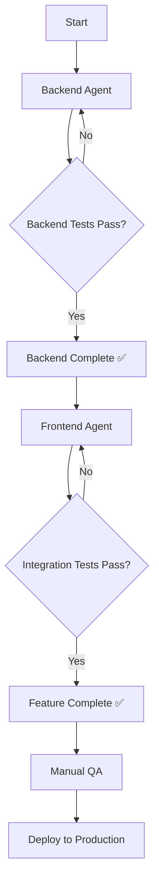

# AI Agent Prompts - SideBy Project

This directory contains specialized prompts for AI agents to implement features in the SideBy monorepo.

---

## 📂 Available Prompts

### 1. Backend Implementation

**File:** [`BACKEND-DATASETS-MODULE.md`](./BACKEND-DATASETS-MODULE.md)

**Target:** @Backend MERN Agent  
**Purpose:** Implement complete CRUD API for Datasets module  
**Estimated Time:** 8-12 hours  
**Prerequisites:** None (can start immediately)

**Delivers:**
- ✅ JWT authentication middleware
- ✅ Datasets CRUD endpoints (POST, GET, PATCH, DELETE)
- ✅ File upload & parsing (CSV/Excel)
- ✅ Data unification with `_source_group` tags
- ✅ MongoDB schema & repository
- ✅ OpenAPI documentation
- ✅ Complete test suite (TDD)

---

### 2. Frontend Integration

**File:** [`FRONTEND-DATASETS-INTEGRATION.md`](./FRONTEND-DATASETS-INTEGRATION.md)

**Target:** @Frontend React Agent  
**Purpose:** Integrate frontend with backend API  
**Estimated Time:** 6-8 hours  
**Prerequisites:** ✅ Backend module MUST be implemented first

**Delivers:**
- ✅ Refactored DataUploadWizard (2-phase flow)
- ✅ Custom React hooks for API calls
- ✅ TypeScript types matching backend contracts
- ✅ Dataset dashboard page
- ✅ Error handling & loading states
- ✅ Integration tests

---

## 🔄 Execution Flow



### Step-by-Step Guide

#### 1️⃣ **Start with Backend**

```bash
# Terminal 1: Start backend API
cd solution-sideby/apps/api
npm run dev
```

Provide `BACKEND-DATASETS-MODULE.md` to the Backend Agent and wait for completion.

**Verification:**
```bash
# Run backend tests
npm test

# Manual test with curl/Postman
curl -X POST http://localhost:3000/api/v1/datasets \
  -H "Authorization: Bearer <TOKEN>" \
  -F "fileA=@test.csv" \
  -F "fileB=@test2.csv"
```

---

#### 2️⃣ **Then Frontend Integration**

```bash
# Terminal 2: Start frontend dev server
cd solution-sideby/apps/client
npm run dev
```

Provide `FRONTEND-DATASETS-INTEGRATION.md` to the Frontend Agent.

**Verification:**
```bash
# Run frontend tests
npm test

# Open browser
open http://localhost:5173
```

Manual flow:
1. Upload two CSV files
2. Configure mapping (dimension + KPIs)
3. Set report name
4. Navigate to dashboard
5. Verify data renders correctly

---

## 🔗 API Contracts

Both prompts reference the same API contracts to ensure compatibility:

| Endpoint | Method | Backend Implements | Frontend Consumes |
|----------|--------|-------------------|-------------------|
| `/api/v1/datasets` | POST | ✅ Upload files | ✅ Phase 1 wizard |
| `/api/v1/datasets/:id` | PATCH | ✅ Update mapping | ✅ Phase 2 wizard |
| `/api/v1/datasets/:id` | GET | ✅ Get dataset | ✅ Dashboard page |
| `/api/v1/datasets` | GET | ✅ List datasets | ✅ Dataset list page |
| `/api/v1/datasets/:id` | DELETE | ✅ Delete | ✅ Delete button |

---

## 🧪 Testing Strategy

### Backend Tests (TDD)

```bash
cd solution-sideby/apps/api
npm test                           # All tests
npm test CreateDatasetUseCase      # Specific use case
npm run test:integration           # Integration tests only
```

### Frontend Tests

```bash
cd solution-sideby/apps/client
npm test                              # All tests
npm test useDatasetUpload             # Specific hook
npm test DataUploadWizard.integration # Integration tests
```

### End-to-End Testing

After both implementations are complete:

```bash
# Start both servers
npm run dev:all  # From monorepo root

# Run E2E tests (if configured)
npm run test:e2e
```

---

## 📋 Checklist for Completion

### Backend Completion ✅

- [ ] All unit tests passing (use cases, domain logic)
- [ ] All integration tests passing (API endpoints)
- [ ] MongoDB connection working
- [ ] JWT middleware validates tokens
- [ ] File upload handles 10MB+ files
- [ ] Row count limit enforced (50k rows)
- [ ] Rate limiting works (10 uploads/hour)
- [ ] OpenAPI docs generated at `/api-docs`
- [ ] Cleanup job tested
- [ ] Manual testing with Postman successful

### Frontend Completion ✅

- [ ] All component tests passing
- [ ] All hook tests passing
- [ ] Integration tests passing
- [ ] Wizard completes 2-phase flow
- [ ] Dashboard renders datasets
- [ ] Error messages user-friendly
- [ ] Loading states smooth
- [ ] TypeScript strict mode (no errors)
- [ ] ESLint passing
- [ ] Manual testing in browser successful

### Integration Verification ✅

- [ ] Upload files → Dataset created in MongoDB
- [ ] Configure mapping → Status changes to 'ready'
- [ ] Dashboard loads data with `_source_group` tags
- [ ] KPI cards calculate correctly
- [ ] Chart renders with group colors
- [ ] Table shows all data rows
- [ ] Delete works and removes from DB
- [ ] Unauthorized access blocked (401)
- [ ] Other user cannot access my datasets

---

## 🐛 Common Issues & Solutions

### Issue: "Authorization token not found"

**Solution:** Ensure `localStorage.getItem('authToken')` returns a valid JWT. Adjust `datasets.api.ts` to match your auth implementation.

```typescript
// In datasets.api.ts
function getAuthToken(): string {
  // Option 1: localStorage
  const token = localStorage.getItem('authToken');
  
  // Option 2: Context/Hook
  // const { token } = useAuth();
  
  // Option 3: Cookie
  // const token = getCookie('auth_token');
  
  if (!token) throw new Error('Not authenticated');
  return token;
}
```

---

### Issue: "CORS error on API requests"

**Solution:** Backend must enable CORS for frontend origin.

```typescript
// apps/api/src/app.ts
import cors from 'cors';

app.use(cors({
  origin: 'http://localhost:5173', // Frontend dev server
  credentials: true
}));
```

---

### Issue: "File upload fails with 413 Payload Too Large"

**Solution:** Increase body size limits in backend.

```typescript
// apps/api/src/app.ts
app.use(express.json({ limit: '50mb' }));
app.use(express.urlencoded({ limit: '50mb', extended: true }));
```

---

### Issue: "Dataset data not rendering in dashboard"

**Debug checklist:**
1. Check `GET /api/v1/datasets/:id` returns `data` array
2. Verify `_source_group` tags exist on rows
3. Console log `dataset.data` in dashboard component
4. Check `schemaMapping.kpiFields` has correct `columnName`
5. Verify chart/table receives non-empty data prop

---

## 📚 Additional Resources

### Backend References

- [RFC-002: Data Ingestion](../RFC-002-DATA_INGESTION.md)
- [RFC-003: Schema Mapping](../RFC-003-SCHEMA_MAPPING.md)
- [Use Cases Document](../../UsesCases.md)
- [Clean Architecture Guide](https://blog.cleancoder.com/uncle-bob/2012/08/13/the-clean-architecture.html)

### Frontend References

- [React Testing Library](https://testing-library.com/react)
- [React Query (for future optimizations)](https://tanstack.com/query)
- [Tailwind CSS](https://tailwindcss.com)
- [shadcn/ui Components](https://ui.shadcn.com)

---

## 🤝 Contributing

When implementing features:

1. **Read the full prompt** before starting
2. **Follow TDD** (write tests first)
3. **Commit frequently** with conventional commit messages
4. **Update CHANGELOG.md** with your changes
5. **Document breaking changes** in commit body

Example commit:

```
feat(api): implement datasets CRUD endpoints

- Add POST /api/v1/datasets for file upload
- Add PATCH /api/v1/datasets/:id for mapping
- Add GET /api/v1/datasets/:id
- Implement JWT authentication middleware
- Add rate limiting (10 uploads/hour)

BREAKING CHANGE: Authentication now required for all dataset endpoints
```

---

## 📞 Support

If you encounter issues not covered in the prompts:

1. Check the [Common Issues](#-common-issues--solutions) section
2. Review related RFCs in `docs/design/`
3. Check the main project README
4. Ask the project architect for clarification

---

**Last Updated:** 2026-02-09  
**Prompt Version:** 1.0  
**Status:** Ready for implementation
