# AI Agent Prompts - SideBy Project

This directory contains specialized prompts for AI agents to implement features in the SideBy monorepo.

---

## 📂 Available Prompts

### 1. Backend Implementation

**File:** [`BACKEND-DATASETS-MODULE.md`](./BACKEND-DATASETS-MODULE.md)

**Target:** @Backend MERN Agent  
**Purpose:** Implement complete CRUD API for Datasets module  
**Estimated Time:** 8-12 hours  
**Prerequisites:** None (can start immediately)

**Delivers:**
- ✅ JWT authentication middleware
- ✅ Datasets CRUD endpoints (POST, GET, PATCH, DELETE)
- ✅ File upload & parsing (CSV/Excel)
- ✅ Data unification with `_source_group` tags
- ✅ MongoDB schema & repository
- ✅ OpenAPI documentation
- ✅ Complete test suite (TDD)

---

### 2. Frontend Integration

**File:** [`FRONTEND-DATASETS-INTEGRATION.md`](./FRONTEND-DATASETS-INTEGRATION.md)

**Target:** @Frontend React Agent  
**Purpose:** Integrate frontend with backend API  
**Estimated Time:** 6-8 hours  
**Prerequisites:** ✅ Backend module MUST be implemented first

**Delivers:**
- ✅ Refactored DataUploadWizard (2-phase flow)
- ✅ Custom React hooks for API calls
- ✅ TypeScript types matching backend contracts
- ✅ Dataset dashboard page
- ✅ Error handling & loading states
- ✅ Integration tests

---

### 3. React Query Migration (NEW)

**Quick Start Guide:** [`REACT-QUERY-START-HERE.md`](./REACT-QUERY-START-HERE.md) ⭐  
**RFC Reference:** [`RFC-React-Query-Migration.md`](../RFC-React-Query-Migration.md)

**Target:** @Frontend React Agent  
**Purpose:** Migrate server state management to TanStack Query v5  
**Estimated Time:** 2 days (12-15 hours)  
**Prerequisites:** ✅ Frontend Datasets Integration must be complete

**8-Phase Implementation:**

| Phase | File | Focus | Time |
|-------|------|-------|------|
| 1️⃣ | [`PHASE-1-REACT-QUERY-SETUP.md`](./PHASE-1-REACT-QUERY-SETUP.md) | QueryClient + DevTools | 2-3h |
| 2️⃣ | [`PHASE-2-REACT-QUERY-QUERIES.md`](./PHASE-2-REACT-QUERY-QUERIES.md) | useDatasets + useDataset | 3-4h |
| 3️⃣ | [`PHASE-3-REACT-QUERY-MUTATIONS.md`](./PHASE-3-REACT-QUERY-MUTATIONS.md) | Update/Delete mutations | 4-5h |
| 4️⃣ | [`PHASE-4-REACT-QUERY-COMPONENTS.md`](./PHASE-4-REACT-QUERY-COMPONENTS.md) | Update components | 2-3h |

**Total Phase 1-4 Time:** 11-15 hours (2 days)

**Delivers:**
- ✅ QueryClient setup with DevTools
- ✅ Migrated hooks (useDatasets, useDataset)
- ✅ Mutations with optimistic updates
- ✅ Cache invalidation strategy
- ✅ Test utils for React Query
- ✅ 37% less boilerplate code
- ✅ 95% faster repeated navigation (cache)
- ✅ Zero duplicate requests

---

### 4. Dashboard Template System (RFC-004)

**RFC Reference:** [`RFC-004-DASHBOARD-TEMPLATE.md`](../RFC-004-DASHBOARD-TEMPLATE.md)

**Target:** @Frontend React Agent  
**Purpose:** Implement complete Dataset Management UI with templates  
**Estimated Time:** 4-5 days (18-23 hours)  
**Prerequisites:** ✅ React Query Migration MUST be complete (Phase 1-4)

**4-Phase Implementation:**

| Phase | File | Focus | Time |
|-------|------|-------|------|
| 5️⃣ | [`PHASE-5-DATASETS-LIST-UPDATE.md`](./PHASE-5-DATASETS-LIST-UPDATE.md) | Edit/Dashboard buttons + navigation | 3-4h |
| 6️⃣ | [`PHASE-6-DATASET-DETAIL.md`](./PHASE-6-DATASET-DETAIL.md) | Edit page with React Hook Form | 5-6h |
| 7️⃣ | [`PHASE-7-DASHBOARD-TEMPLATES.md`](./PHASE-7-DASHBOARD-TEMPLATES.md) | Template system + filters + KPIs | 8-10h |
| 8️⃣ | [`PHASE-8-INTEGRATION-TESTS.md`](./PHASE-8-INTEGRATION-TESTS.md) | E2E tests + validation | 2-3h |

**Total Phase 5-8 Time:** 18-23 hours (4-5 days)

**Delivers:**
- ✅ DatasetsList with real API + Edit/Dashboard buttons
- ✅ DatasetDetail edit page with feature flag
- ✅ 3 dashboard templates (Executive, Trends, Detailed)
- ✅ Dynamic filters by categorical dimensions
- ✅ KPI calculations and comparisons (A vs B)
- ✅ Optimistic updates throughout
- ✅ Complete E2E test suite
- ✅ Coverage >= 80%

**Grand Total (Phase 1-8):** 29-38 hours (6-7 days)

---

## � Quick Start for Implementation

**📖 START HERE:** [`IMPLEMENTATION-GUIDE.md`](./IMPLEMENTATION-GUIDE.md) ⭐⭐⭐

Esta guía te lleva paso a paso con validación automática entre fases.

**🧪 Script de Validación:** `validate-phase.ps1` (en la raíz del proyecto)

**Uso rápido:**
```powershell
# Después de implementar cada fase:
.\validate-phase.ps1 -Phase 1  # Valida Phase-1
.\validate-phase.ps1 -Phase 2  # Valida Phase-2
# ... etc
```

---

## 🔄 Execution Flow

```mermaid
graph TD
    A[Start] --> B[Backend Agent]
    B --> C{Backend Tests Pass?}
    C -->|No| B
    C -->|Yes| D[Backend Complete ✅]
    D --> E[Frontend Agent]
    E --> F{Integration Tests Pass?}
    F -->|No| E
    F -->|Yes| G[Feature Complete ✅]
    G --> H[Manual QA]
    H --> I[Deploy to Production]
```



### Step-by-Step Guide (Legacy - Use IMPLEMENTATION-GUIDE.md instead)

#### 1️⃣ **Start with Backend**

```bash
# Terminal 1: Start backend API
cd solution-sideby/apps/api
npm run dev
```

Provide `BACKEND-DATASETS-MODULE.md` to the Backend Agent and wait for completion.

**Verification:**
```bash
# Run backend tests
npm test

# Manual test with curl/Postman
curl -X POST http://localhost:3000/api/v1/datasets \
  -H "Authorization: Bearer <TOKEN>" \
  -F "fileA=@test.csv" \
  -F "fileB=@test2.csv"
```

---

#### 2️⃣ **Then Frontend Integration**

```bash
# Terminal 2: Start frontend dev server
cd solution-sideby/apps/client
npm run dev
```

Provide `FRONTEND-DATASETS-INTEGRATION.md` to the Frontend Agent.

**Verification:**
```bash
# Run frontend tests
npm test

# Open browser
open http://localhost:5173
```

Manual flow:
1. Upload two CSV files
2. Configure mapping (dimension + KPIs)
3. Set report name
4. Navigate to dashboard
5. Verify data renders correctly

---

## 🔗 API Contracts

Both prompts reference the same API contracts to ensure compatibility:

| Endpoint | Method | Backend Implements | Frontend Consumes |
|----------|--------|-------------------|-------------------|
| `/api/v1/datasets` | POST | ✅ Upload files | ✅ Phase 1 wizard |
| `/api/v1/datasets/:id` | PATCH | ✅ Update mapping | ✅ Phase 2 wizard |
| `/api/v1/datasets/:id` | GET | ✅ Get dataset | ✅ Dashboard page |
| `/api/v1/datasets` | GET | ✅ List datasets | ✅ Dataset list page |
| `/api/v1/datasets/:id` | DELETE | ✅ Delete | ✅ Delete button |

---

## 🧪 Testing Strategy

### Backend Tests (TDD)

```bash
cd solution-sideby/apps/api
npm test                           # All tests
npm test CreateDatasetUseCase      # Specific use case
npm run test:integration           # Integration tests only
```

### Frontend Tests

```bash
cd solution-sideby/apps/client
npm test                              # All tests
npm test useDatasetUpload             # Specific hook
npm test DataUploadWizard.integration # Integration tests
```

### End-to-End Testing

After both implementations are complete:

```bash
# Start both servers
npm run dev:all  # From monorepo root

# Run E2E tests (if configured)
npm run test:e2e
```

---

## 📋 Checklist for Completion

### Backend Completion ✅

- [ ] All unit tests passing (use cases, domain logic)
- [ ] All integration tests passing (API endpoints)
- [ ] MongoDB connection working
- [ ] JWT middleware validates tokens
- [ ] File upload handles 10MB+ files
- [ ] Row count limit enforced (50k rows)
- [ ] Rate limiting works (10 uploads/hour)
- [ ] OpenAPI docs generated at `/api-docs`
- [ ] Cleanup job tested
- [ ] Manual testing with Postman successful

### Frontend Completion ✅

- [ ] All component tests passing
- [ ] All hook tests passing
- [ ] Integration tests passing
- [ ] Wizard completes 2-phase flow
- [ ] Dashboard renders datasets
- [ ] Error messages user-friendly
- [ ] Loading states smooth
- [ ] TypeScript strict mode (no errors)
- [ ] ESLint passing
- [ ] Manual testing in browser successful

### Integration Verification ✅

- [ ] Upload files → Dataset created in MongoDB
- [ ] Configure mapping → Status changes to 'ready'
- [ ] Dashboard loads data with `_source_group` tags
- [ ] KPI cards calculate correctly
- [ ] Chart renders with group colors
- [ ] Table shows all data rows
- [ ] Delete works and removes from DB
- [ ] Unauthorized access blocked (401)
- [ ] Other user cannot access my datasets

---

## 🐛 Common Issues & Solutions

### Issue: "Authorization token not found"

**Solution:** Ensure `localStorage.getItem('authToken')` returns a valid JWT. Adjust `datasets.api.ts` to match your auth implementation.

```typescript
// In datasets.api.ts
function getAuthToken(): string {
  // Option 1: localStorage
  const token = localStorage.getItem('authToken');
  
  // Option 2: Context/Hook
  // const { token } = useAuth();
  
  // Option 3: Cookie
  // const token = getCookie('auth_token');
  
  if (!token) throw new Error('Not authenticated');
  return token;
}
```

---

### Issue: "CORS error on API requests"

**Solution:** Backend must enable CORS for frontend origin.

```typescript
// apps/api/src/app.ts
import cors from 'cors';

app.use(cors({
  origin: 'http://localhost:5173', // Frontend dev server
  credentials: true
}));
```

---

### Issue: "File upload fails with 413 Payload Too Large"

**Solution:** Increase body size limits in backend.

```typescript
// apps/api/src/app.ts
app.use(express.json({ limit: '50mb' }));
app.use(express.urlencoded({ limit: '50mb', extended: true }));
```

---

### Issue: "Dataset data not rendering in dashboard"

**Debug checklist:**
1. Check `GET /api/v1/datasets/:id` returns `data` array
2. Verify `_source_group` tags exist on rows
3. Console log `dataset.data` in dashboard component
4. Check `schemaMapping.kpiFields` has correct `columnName`
5. Verify chart/table receives non-empty data prop

---

## 📚 Additional Resources

### Backend References

- [RFC-002: Data Ingestion](../RFC-002-DATA_INGESTION.md)
- [RFC-003: Schema Mapping](../RFC-003-SCHEMA_MAPPING.md)
- [Use Cases Document](../../UsesCases.md)
- [Clean Architecture Guide](https://blog.cleancoder.com/uncle-bob/2012/08/13/the-clean-architecture.html)

### Frontend References

- [React Testing Library](https://testing-library.com/react)
- [React Query (for future optimizations)](https://tanstack.com/query)
- [Tailwind CSS](https://tailwindcss.com)
- [shadcn/ui Components](https://ui.shadcn.com)

---

## 🤝 Contributing

When implementing features:

1. **Read the full prompt** before starting
2. **Follow TDD** (write tests first)
3. **Commit frequently** with conventional commit messages
4. **Update CHANGELOG.md** with your changes
5. **Document breaking changes** in commit body

Example commit:

```
feat(api): implement datasets CRUD endpoints

- Add POST /api/v1/datasets for file upload
- Add PATCH /api/v1/datasets/:id for mapping
- Add GET /api/v1/datasets/:id
- Implement JWT authentication middleware
- Add rate limiting (10 uploads/hour)

BREAKING CHANGE: Authentication now required for all dataset endpoints
```

---

## 📞 Support

If you encounter issues not covered in the prompts:

1. Check the [Common Issues](#-common-issues--solutions) section
2. Review related RFCs in `docs/design/`
3. Check the main project README
4. Ask the project architect for clarification

---

**Last Updated:** 2026-02-13  
**Prompt Version:** 2.0  
**Status:** All phases complete and ready for implementation

---

## 🆕 Complete Implementation Roadmap

The project has been fully documented with an 8-phase implementation plan:

### Phase 1-4: React Query Migration (Days 1-2)
Foundation for modern state management with caching and optimistic updates.

1. **PHASE-1-REACT-QUERY-SETUP.md** - QueryClient setup (2-3h)
2. **PHASE-2-REACT-QUERY-QUERIES.md** - Migrate queries (3-4h)
3. **PHASE-3-REACT-QUERY-MUTATIONS.md** - Implement mutations (4-5h)
4. **PHASE-4-REACT-QUERY-COMPONENTS.md** - Update components (2-3h)

### Phase 5-8: RFC-004 Dashboard Template System (Days 3-7)
Complete dataset management UI with templates and filters.

5. **PHASE-5-DATASETS-LIST-UPDATE.md** - Navigation buttons (3-4h)
6. **PHASE-6-DATASET-DETAIL.md** - Edit page with forms (5-6h)
7. **PHASE-7-DASHBOARD-TEMPLATES.md** - Template system (8-10h)
8. **PHASE-8-INTEGRATION-TESTS.md** - E2E tests (2-3h)

**Start here:** [`REACT-QUERY-START-HERE.md`](./REACT-QUERY-START-HERE.md) for quick start guide.

**These phases MUST be completed sequentially** - each phase builds on the previous one.
